- يمكنك استخدام الحقيبة الخاصة بسكراتش لتخزين المظاهر والكائنات والأصوات والنصوص التي تريد نسخها بين المشاريع.

- يمكنك فقط الوصول إلى حقيبة الخاصة بك ، ويجب أن تقوم بتسجيل الدخول إلى حساب سكراتش الخاص بك لاستخدامها.

- لفتح الحقيبة الخاصة بك ، انقر فوق علامة التبويب **الحقيبة** في الجزء السفلي من الشاشة.

--- no-print ---

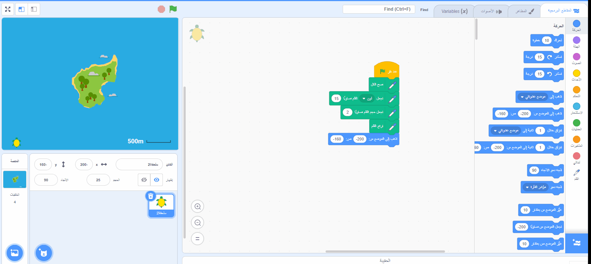

--- /no-print ---

--- print-only ---

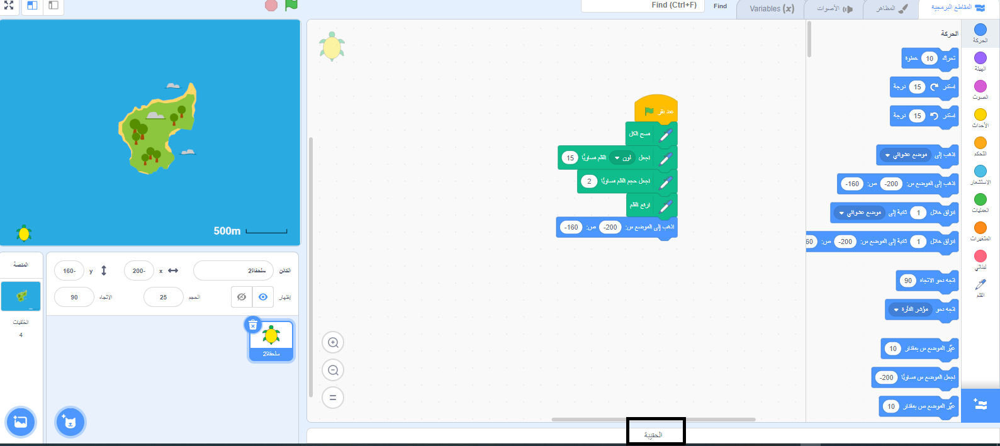

--- /print-only ---

- لإضافة كائن إلى الحقيبة الخاصة بك ، اسحب الكائن من قائمة الكائن إلى حقيبة. سيؤدي هذا إلى تخزين الكائن بالكامل في الحقيبة الخاصة بك ، بما في ذلك جميع المظاهر والأصوات والنصوص.

--- no-print ---

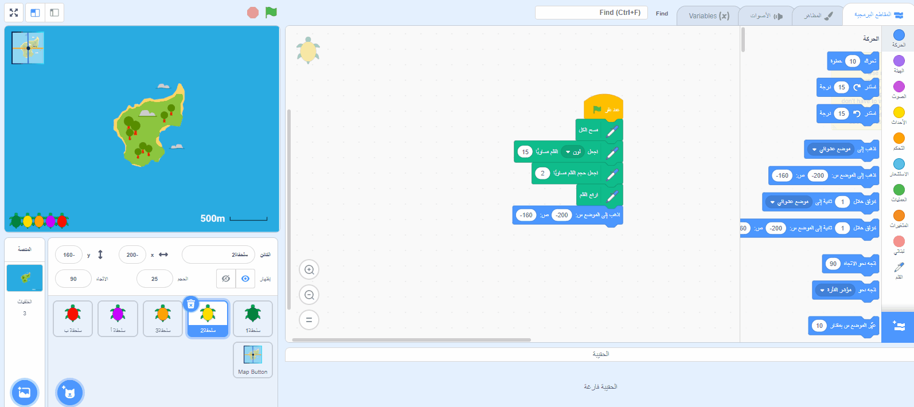

--- /no-print ---

--- print-only ---

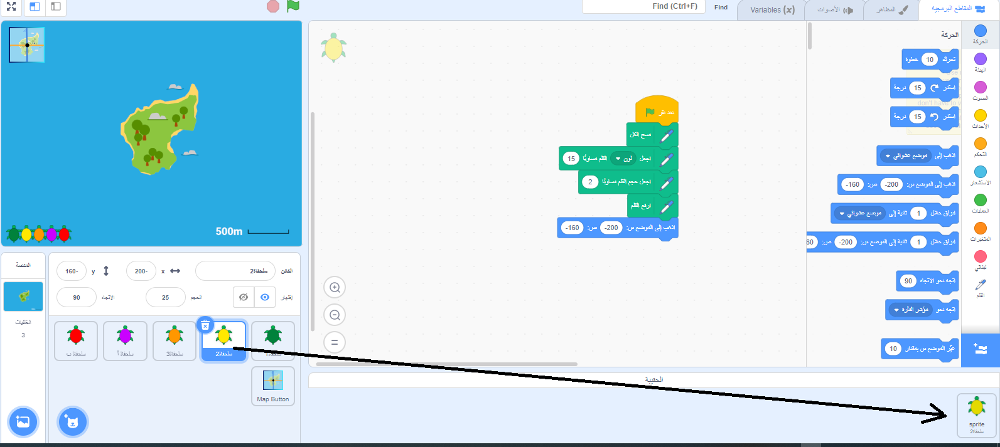

--- /print-only ---

- لإضافة خلفية إلى الحقيبة الخاصة بك ، حدد جزء المنصة وانقر فوق علامة التبويب **الخلفيات** ، ثم اختر الخلفية التي تريدها واسحبها إلى حقيبة الظهر الخاصة بك.

--- no-print ---

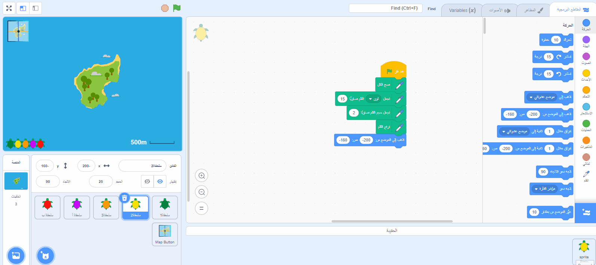

--- /no-print ---

--- print-only ---

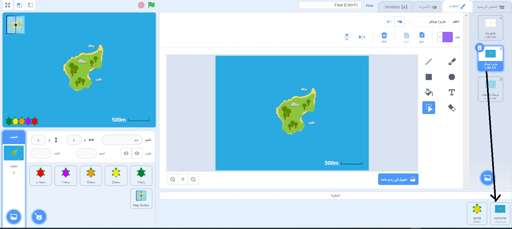

--- /print-only ---

- لاستخدام عنصر في الحقيبة الخاصة بك في مشروع آخر ، افتح المشروع واسحب العنصر من الحقيبة إلى الجزء أو علامة التبويب الصحيحة.

--- no-print ---

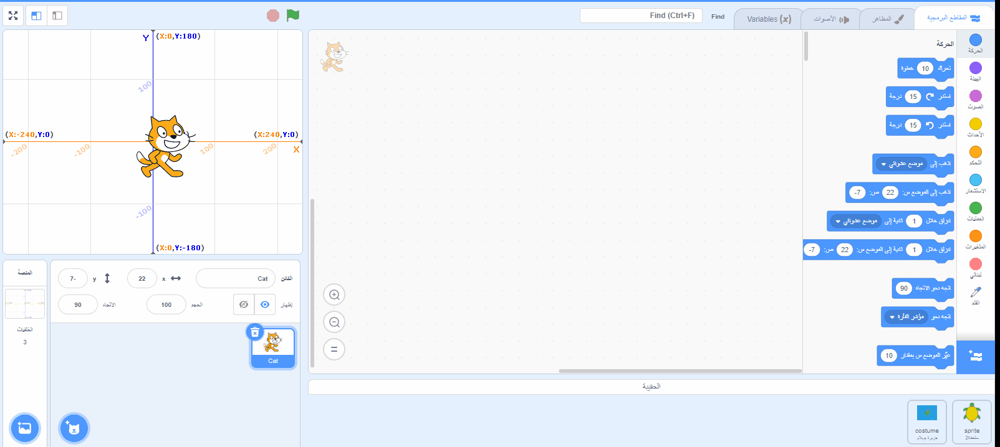

--- /no-print ---

--- print-only ---

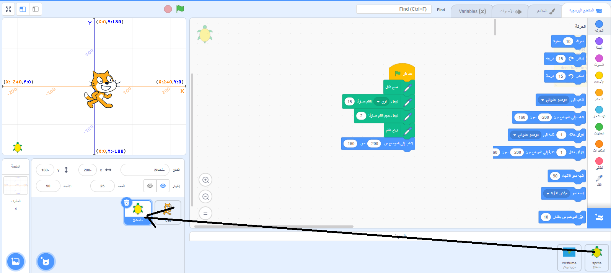

--- /print-only ---

- لحذف عنصر في الحقيبة الخاصة بك ، ابحث عن العنصر في علامة التبويب **الحقيبة** ، ثم انقر بزر الماوس الأيمن (أو على الكمبيوتر اللوحي ، انقر مع الاستمرار) على العنصر وحدد **حذف**.

--- no-print ---

--- /no-print ---

--- print-only ---

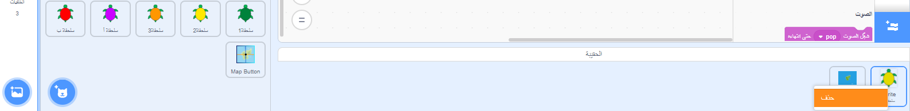

--- /print-only ---

- يمكنك إخفاء الحقيبة الخاصة بك عند عدم استخدامها. للقيام بذلك ، انقر فوق علامة التبويب **الحقيبة** في الجزء السفلي من الشاشة.

--- no-print ---

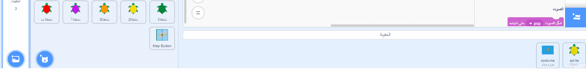

--- /no-print ---

--- print-only ---

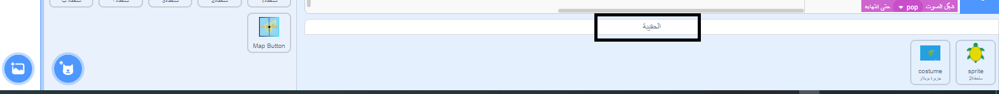

--- /print-only ---
