- Galli di ddefnyddio dy Becyn Cefn Scratch i storio gwisgoedd, corluniau, seiniau a sgriptiau rwyt ti am eu copïo rhwng prosiectau.

- Dim ond dy Becyn Cefn dy hun alli di gael mynediad ato, a rhaid i ti fewngofnodi i dy gyfrif Scratch i'w ddefnyddio.

- I agor dy Becyn Cefn, clicia ar y tab **Pecyn Cefn** ar waelod y sgrin.

--- no-print ---

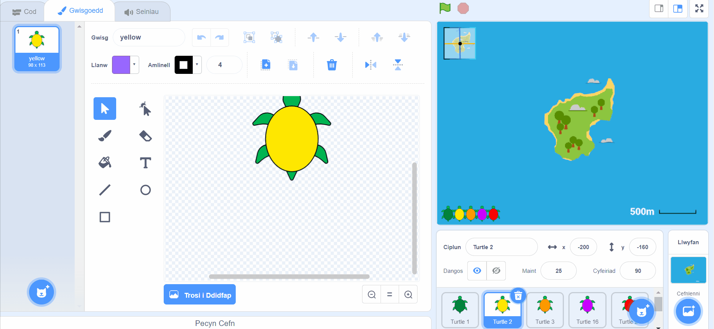

--- /no-print ---

--- print-only ---

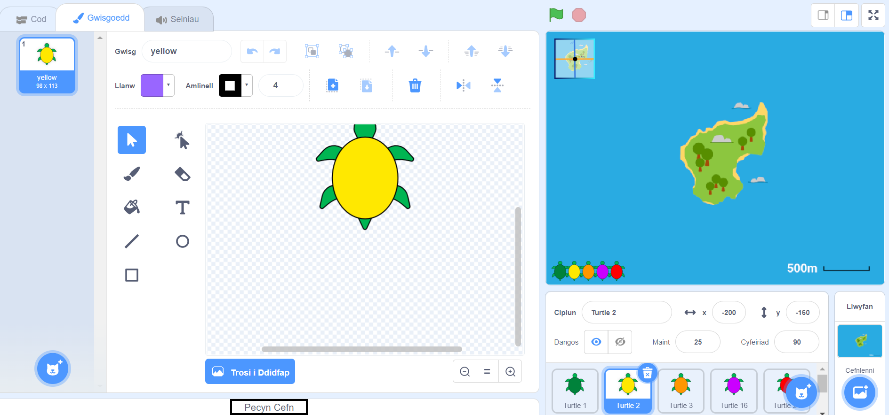

--- /print-only ---

- I ychwanegu corlun i dy Becyn Cefn, llusga'r corlun o'r rhestr Corluniau i'r Pecyn Cefn. Bydd hyn yn storio'r corlun llawn yn dy Becyn Cefn, gan gynnwys ei holl wisgoedd, seiniau a sgriptiau.

--- no-print ---

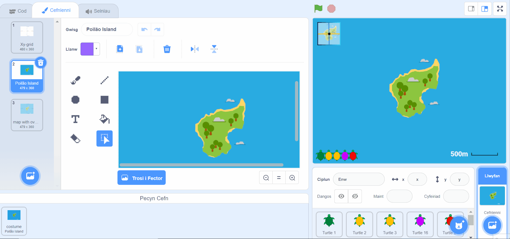

--- /no-print ---

--- print-only ---

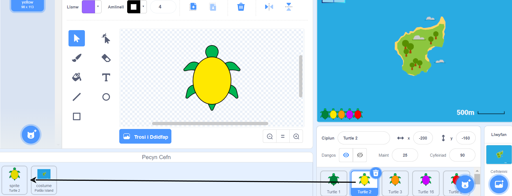

--- /print-only ---

- I ychwanegu cefnlen i dy Becyn Cefn, dewisa'r cwarel Llwyfan a chlicio ar y **Cefnlenni**, yna dewisa'r gefnlen rwyt ti ei eisiau a'i lusgo i dy Becyn Cefn.

--- no-print ---

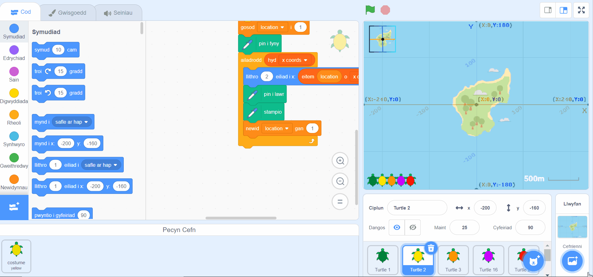

--- /no-print ---

--- print-only ---

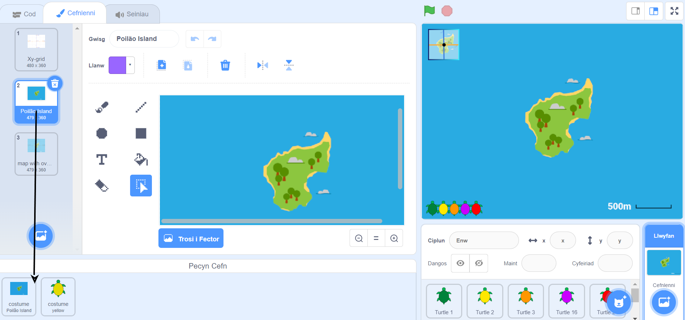

--- /print-only ---

- I ddefnyddio eitem yn dy Becyn Cefn mewn prosiect arall, agora'r prosiect a llusga'r eitem o'r Pecyn Cefn i'r cwarel neu'r tab cywir.

--- no-print ---

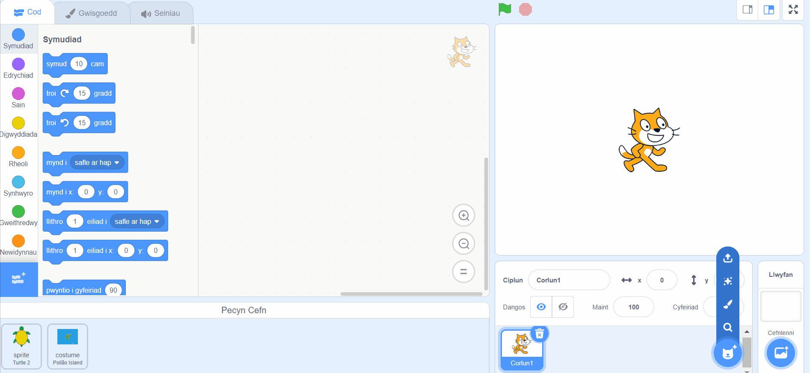

--- /no-print ---

--- print-only ---

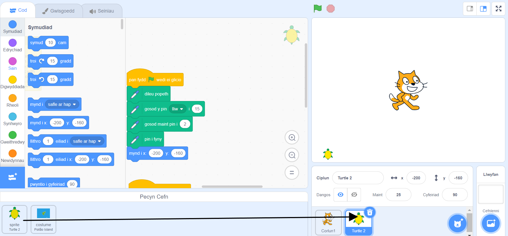

--- /print-only ---

- I ddileu eitem yn dy becyn cefn, edrycha am yr eitem yn y **Pecyn Cefn**, yna de-glicia (neu ar dabled, taro a dal) ar yr eitem a dewis **dileu**.

--- no-print ---

--- /no-print ---

--- print-only ---

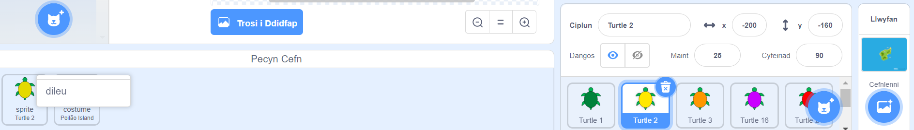

--- /print-only ---

- Galli di guddio dy Becyn Cefn pan dwyt ti ddim yn ei ddefnyddio. I wneud hyn, clicia ar y tab **Pecyn Cefn** ar waelod y sgrin.

--- no-print ---

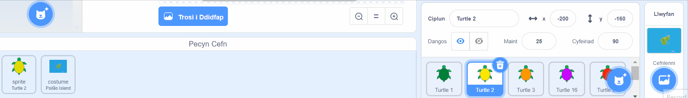

--- /no-print ---

--- print-only ---

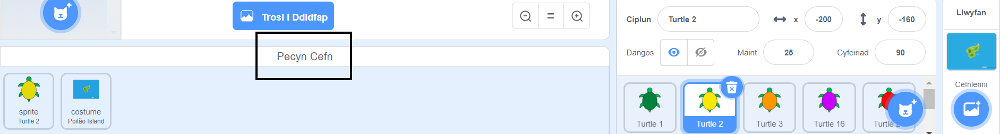

--- /print-only ---
