- Du kannst dein Scratch-Lager zum Speichern von Kostümen, Figuren, Klängen und Skripten verwenden, die du zwischen Projekten kopieren möchtest.

- Du kannst nur auf dein eigenes Lager zugreifen und musst mit deinem Scratch-Konto angemeldet sein, um es verwenden zu können.

- Um dein Lager zu öffnen, klicke am unteren Bildschirmrand auf die Registerkarte **Lager**.

--- no-print ---

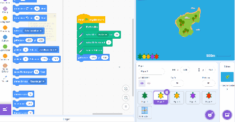

--- /no-print ---

--- print-only ---

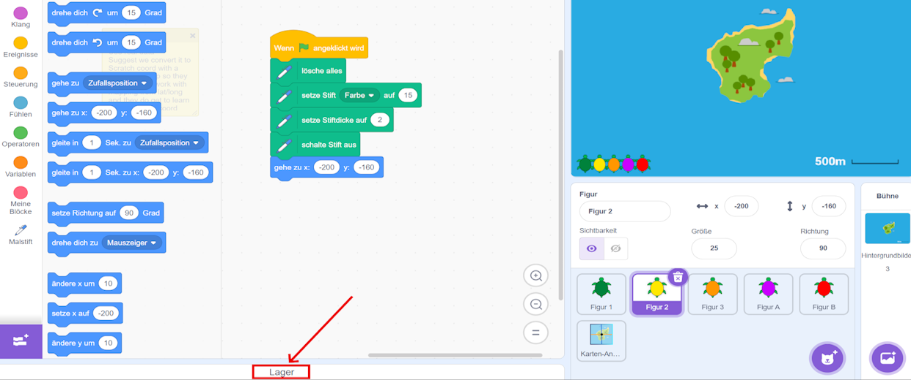

--- /print-only ---

- Um eine Figur deinem Lager hinzuzufügen, ziehe die Figur aus der Figuren-Liste in das Lager. Dadurch wird die vollständige Figur in deinem Lager gespeichert, einschließlich aller Kostüme, Klänge und Skripte.

--- no-print ---

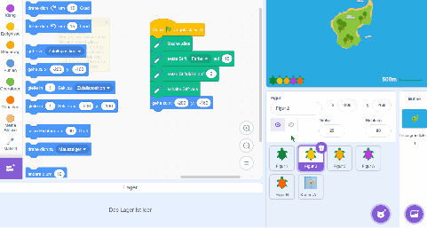

--- /no-print ---

--- print-only ---

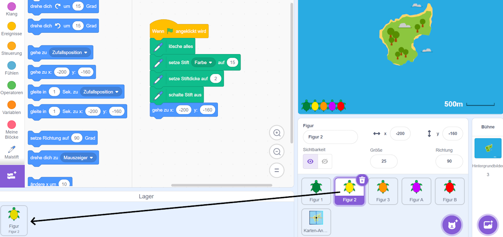

--- /print-only ---

- Um deinem Lager einen Hintergrund hinzuzufügen, wähle den Bereich Bühne aus und klicke auf die Registerkarte **Hintergrundbilder**. Wähle dann den gewünschten Hintergrund aus und ziehe ihn in das Lager.

--- no-print ---

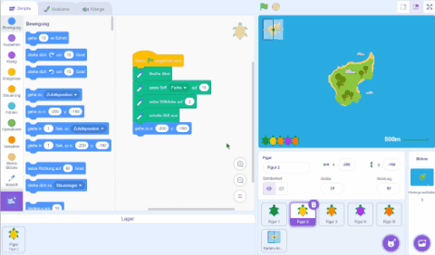

--- /no-print ---

--- print-only ---

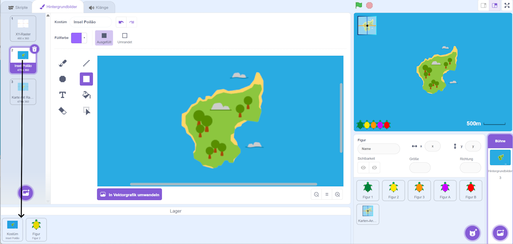

--- /print-only ---

- Um ein Element aus deinem Lager in einem anderen Projekt zu verwenden, öffnest du dieses Projekt und ziehst das Element aus dem Lager in den richtigen Bereich oder die richtige Registerkarte.

--- no-print ---

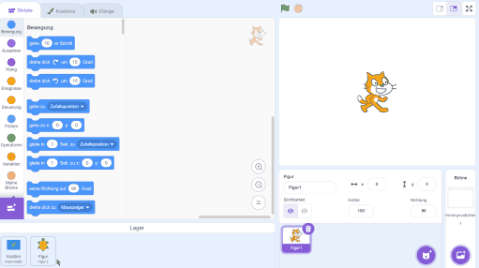

--- /no-print ---

--- print-only ---

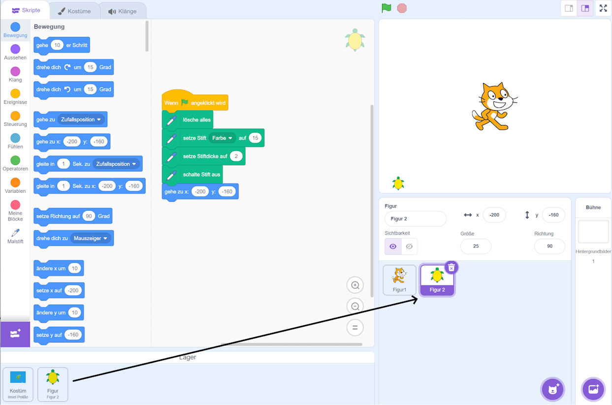

--- /print-only ---

- Um ein Element aus dem Lager zu löschen, suche dieses Element in deinem **Lager**, klicke dann mit der rechten Maustaste darauf (oder tippe und halte es auf deinem Tablet) und wähle **Löschen**.

--- no-print ---

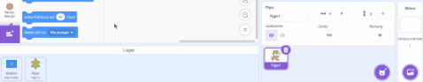

--- /no-print ---

--- print-only ---

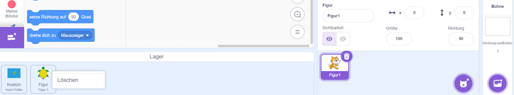

--- /print-only ---

- Du kannst dein Lager ausblenden, wenn du es nicht verwendest. Klicke dazu am unteren Bildschirmrand auf die Registerkarte **Lager**.

--- no-print ---

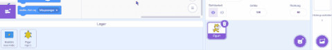

--- /no-print ---

--- print-only ---

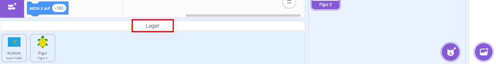

--- /print-only ---
