- Μπορείς να χρησιμοποιήσεις το Σακίδιο σου στο Scratch για να αποθηκεύσεις ενδυμασίες, αντικείμενα, ήχους και script που μπορεί να θελήσεις να αντιγράψεις σε άλλα έργα.

- Μπορείς να έχεις πρόσβαση μόνο στο δικό σου Σακίδιο και πρέπει να είσαι συνδεδεμένος/η στον λογαριασμό σου στο Scratch για να το χρησιμοποιήσεις.

- Για να ανοίξεις το Σακίδιό σου, κάνε κλικ στην καρτέλα **Σακίδιο** στο κάτω μέρος της οθόνης.

--- no-print ---

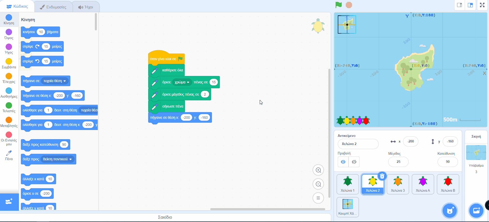

--- /no-print ---

--- print-only ---

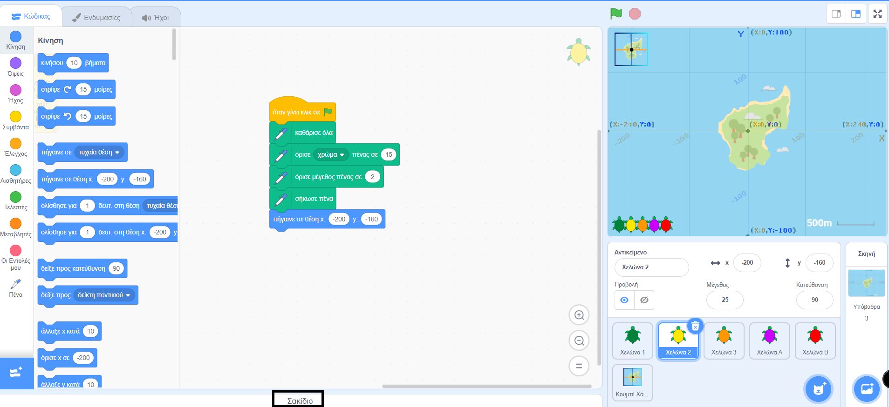

--- /print-only ---

- Για να προσθέσεις ένα αντικείμενο στο Σακίδιο σου, σύρε το αντικείμενο από τη λίστα Αντικειμένων στο Σακίδιο. Αυτό θα αποθηκεύσει ολόκληρο το αντικείμενο στο Σακίδιο σου, συμπεριλαμβανομένων όλων των ενδυμασιών, των ήχων και των script του.

--- no-print ---

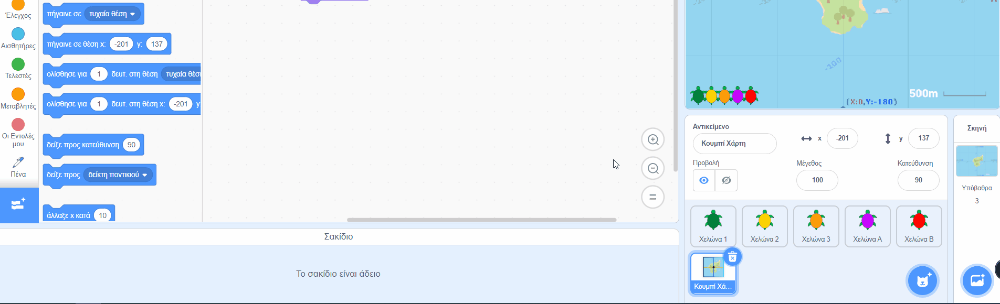

--- /no-print ---

--- print-only ---

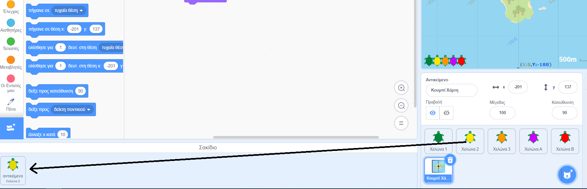

--- /print-only ---

- Για να προσθέσεις ένα υπόβαθρο στο Σακίδιο σου, επίλεξε το παράθυρο Σκηνή και κάνε κλικ στην καρτέλα **Υπόβαθρα** και, στη συνέχεια, επίλεξε το υπόβαθρο που θέλεις και μπορείς να το σύρεις στο Σακίδιο σου.

--- no-print ---

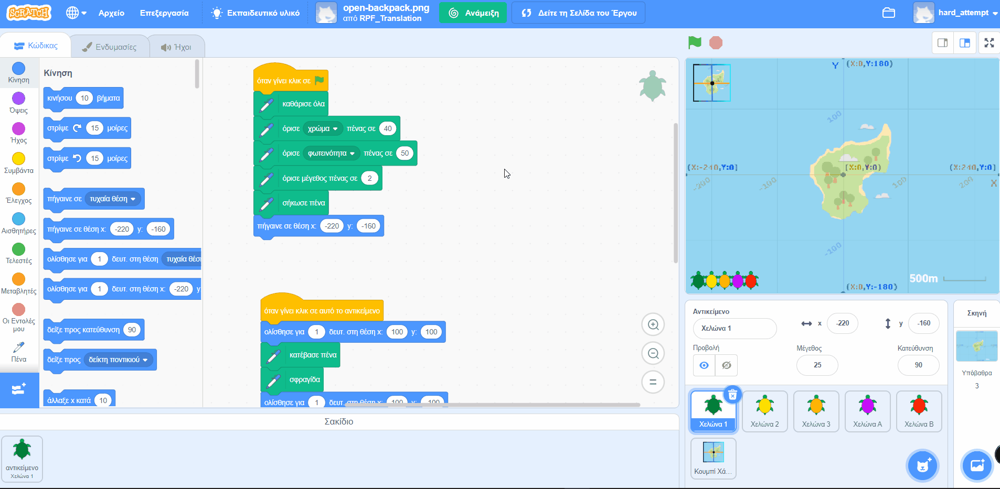

--- /no-print ---

--- print-only ---

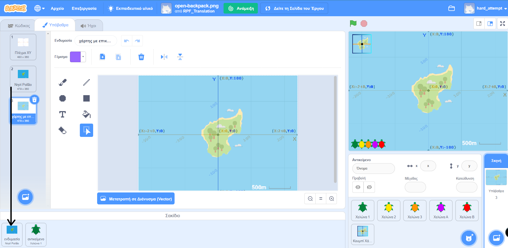

--- /print-only ---

- Για να χρησιμοποιήσεις ένα αντικείμενο στο Σακίδιο σου σε άλλο έργο, άνοιξε το έργο και σύρε το αντικείμενο από το Σακίδιο στο σωστό παράθυρο ή καρτέλα.

--- no-print ---

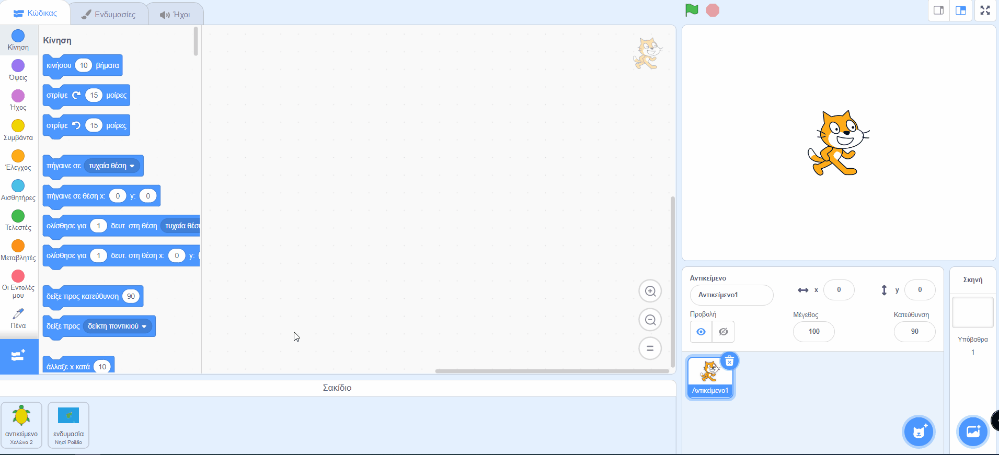

--- /no-print ---

--- print-only ---

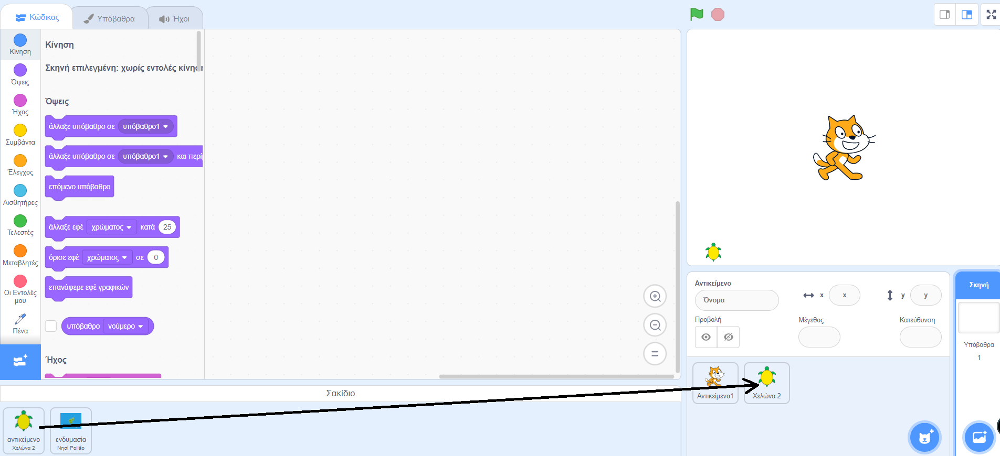

--- /print-only ---

- Για να διαγράψεις ένα αντικείμενο στο Σακίδιο σου, εντόπισε το στοιχείο στην καρτέλα **Σακίδιο** και, στη συνέχεια, κάνε δεξί κλικ (ή σε tablet, πάτησε παρατεταμένα) στο αντικείμενο και επίλεξε **διαγραφή**.

--- no-print ---

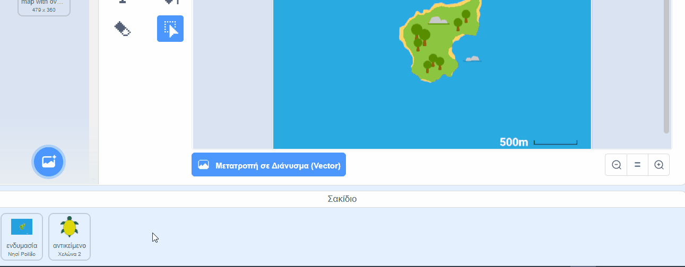

--- /no-print ---

--- print-only ---

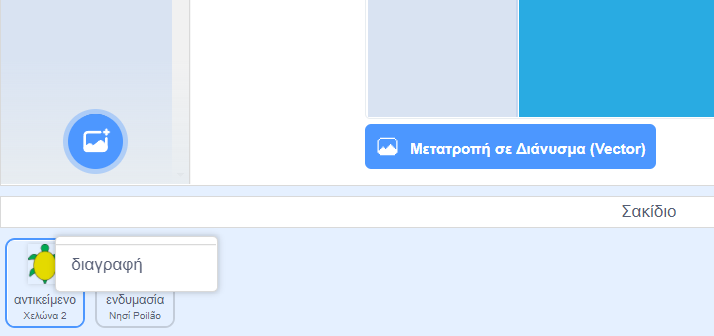

--- /print-only ---

- Μπορείς να κρύψεις το Σακίδιο σου όταν δεν το χρησιμοποιείς. Για να το κάνεις αυτό, κάνε κλικ στην καρτέλα **Σακίδιο** στο κάτω μέρος της οθόνης.

--- no-print ---

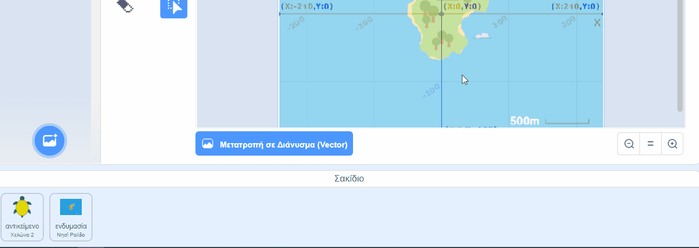

--- /no-print ---

--- print-only ---

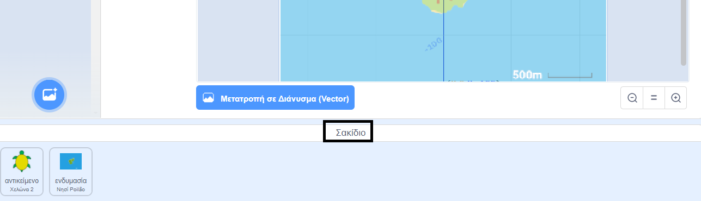

--- /print-only ---
