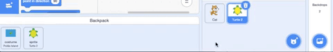

- Your Scratch backpack can be used to store costumes, sprites, sounds and scripts you want to keep for use in other projects.

- You can only access your own backpack and must be logged into your Scratch account to use it.

- Open your backpack by clicking on the backpack title bar.

--- no-print ---

--- /no-print ---

--- print-only ---

--- /print-only ---

- To add a sprite, drag the sprite from the Sprite pane to the backpack. This will store the full sprite in your backpack including all costumes, sounds and script.

--- no-print ---

--- /no-print ---

--- print-only ---

--- /print-only ---

- To add a backdrop to your backpack, select the Backdrops pane and click on the Costumes tab choose the backdrop you want and drag it to your backpack.

--- no-print ---

--- /no-print ---

--- print-only ---

--- /print-only ---

- To use your backpack items in another project, drag items you need to their correct pane or tab in your chosen project.

--- no-print ---

--- /no-print ---

--- print-only ---

--- /print-only ---

- You can hide your backpack when you're not using it by clicking on the backpack title bar.

--- no-print ---

--- /no-print ---

--- print-only ---

--- /print-only ---
