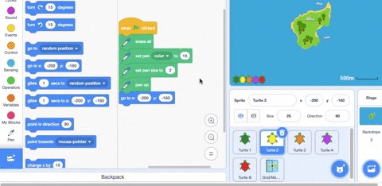
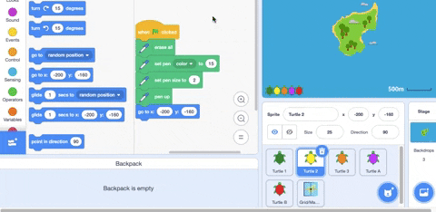
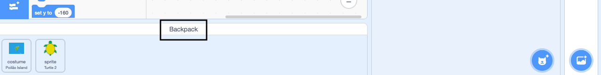

- Your Scratch backpack can be used to store costumes, sprites, sounds and scripts that you want to copy between projects.

- You can only access your own backpack and must be logged into your Scratch account to use it.

- Open your backpack by clicking on the **Backpack** tab at the bottom of the screen.

--- no-print ---

--- /no-print ---

--- print-only ---

--- /print-only ---

- To add a sprite, drag the sprite from the Sprite pane to the backpack. This will store the full sprite in your backpack including all costumes, sounds and script.

--- no-print ---

--- /no-print ---

--- print-only ---

--- /print-only ---

- To add a backdrop to your backpack, select the Backdrops pane and click on the **Costumes** tab choose the backdrop you want and drag it to your backpack.

--- no-print ---

--- /no-print ---

--- print-only ---

--- /print-only ---

- To use your backpack items in another project, open the project and drag items you need to their correct pane or tab.

--- no-print ---

--- /no-print ---

--- print-only ---

--- /print-only ---

- To delete items from your backpack, find the item in the **Backpack** tab then right-click and select delete.

--- no-print ---

--- /no-print ---

--- print-only ---

--- /print-only ---

- You can hide your backpack when you're not using it by clicking on the **Backpack** tab at the bottom of the screen.

--- no-print ---

--- /no-print ---

--- print-only ---

--- /print-only ---
