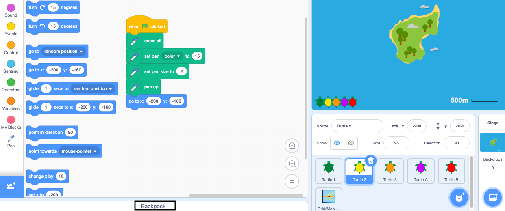
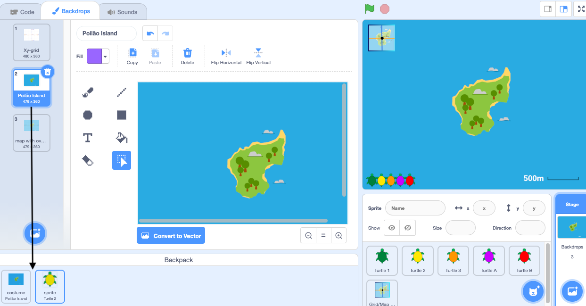

- Your Scratch backpack can be used to store costumes, sprites, sounds and scripts you want to keep for use in other projects.

- You can only access your own backpack and must be logged into your Scratch account to use it.

--- no-print ---

--- /no-print ---

--- print-only ---

--- /print-only ---

- Click on the **Share** button to make it public.

--- no-print ---

--- /no-print ---

--- print-only ---

--- /print-only ---

- You can add instructions on how to use your project.

--- no-print ---

--- /no-print ---

--- print-only ---

--- /print-only ---

- If this is an original project you can add some simple comments. If you've remixed it, then you can credit the original author.

--- no-print ---

--- /no-print ---

--- print-only ---

--- /print-only ---

- Click on the **Copy link** button to get the link to your project. You can send this link to other people by email, text or on social media.

--- no-print ---

--- /no-print ---

--- print-only ---

--- /print-only ---

- Scratch provides the ability to comment on your own and other's projects. If you are under thirteen, or don't want to allow people to comment on your project, it is probably best to turn off commenting.

- If you are happy and feel safe enough to allow people to write comments on your project, then you can leave the first comment.
