- Puedes usar la mochila de Scratch para almacenar disfraces, objetos, sonidos y scripts que deseas copiar entre proyectos.

- Solo puedes acceder a la tuya propia y debes iniciar sesión en tu cuenta de Scratch para usarla.

- Para abrir la Mochila, haz clic en la pestaña **Mochila** en la parte inferior de la pantalla.

--- no-print ---

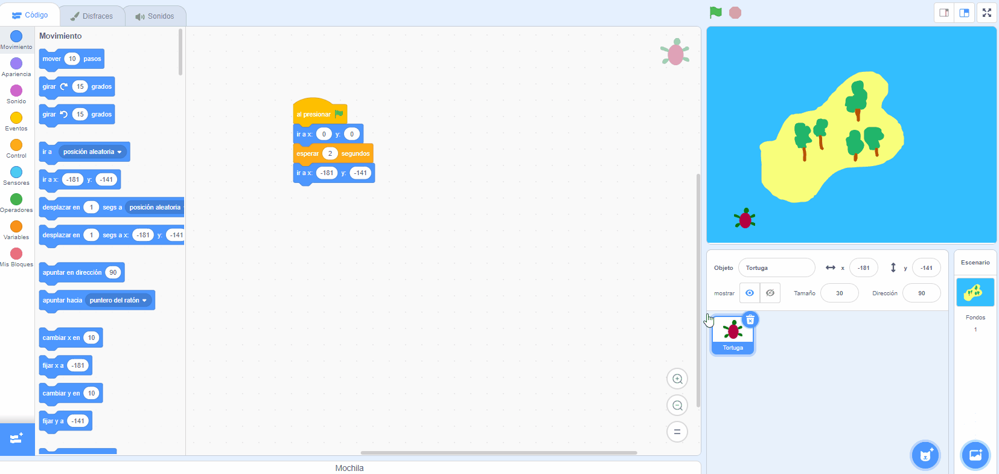

--- /no-print ---

--- print-only ---

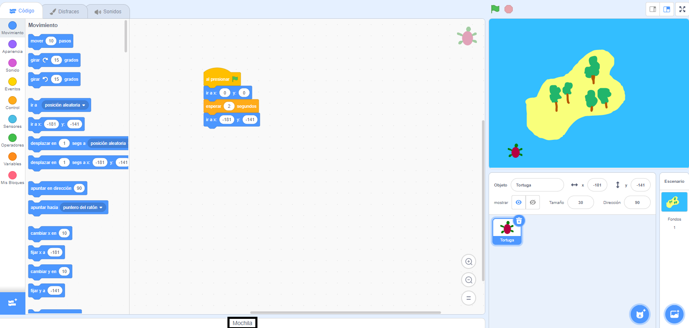

--- /print-only ---

- Para agregarle un objeto, arrástralo desde la lista de objetos a la mochila. Esto almacenará el objeto completo en tu mochila, incluidos todos sus disfraces, sonidos y scripts.

--- no-print ---

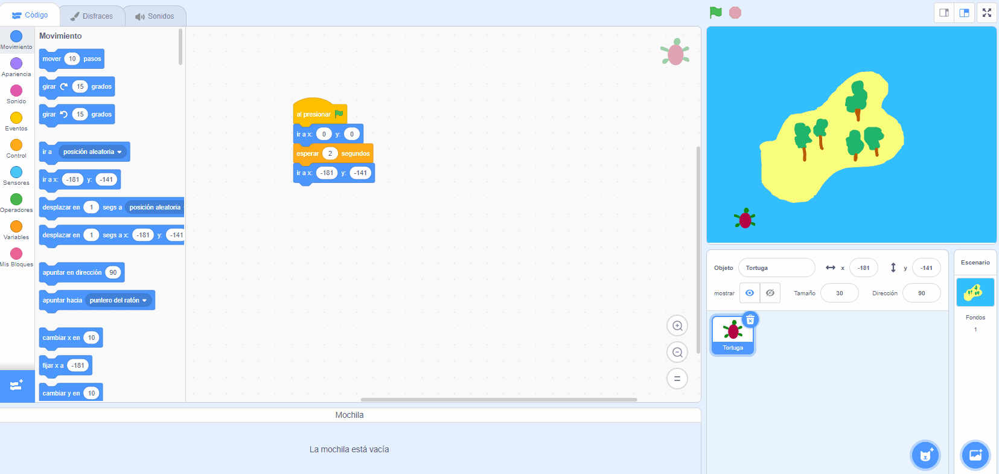

--- /no-print ---

--- print-only ---

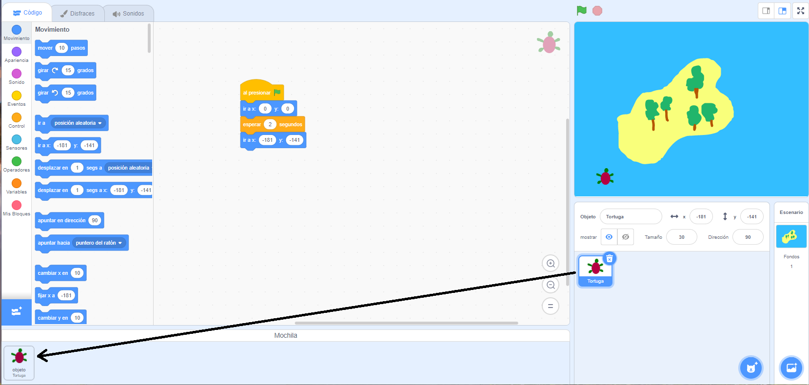

--- /print-only ---

- Para agregarle un fondo, selecciona el panel Escenario y haz clic en la pestaña **Fondos**, luego elige el que desees y arrástralo a la Mochila.

--- no-print ---

--- /no-print ---

--- print-only ---

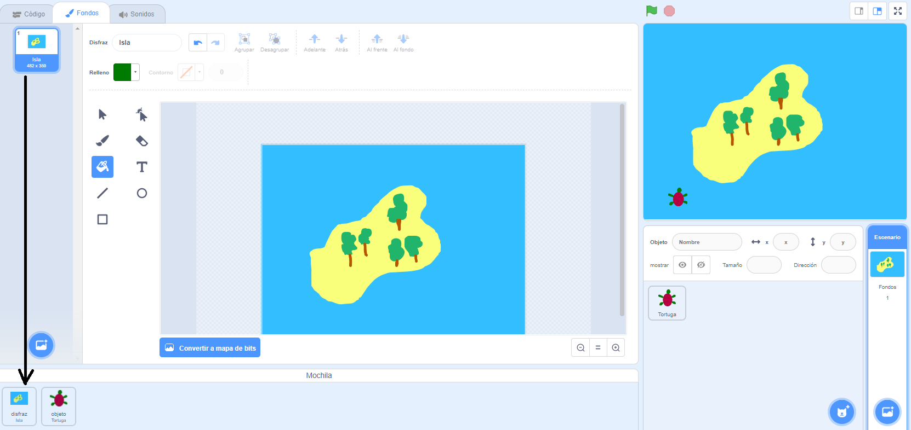

--- /print-only ---

- Para usar un elemento en otro proyecto, abre el proyecto y arrastra el elemento desde la Mochila al panel o pestaña correctos.

--- no-print ---

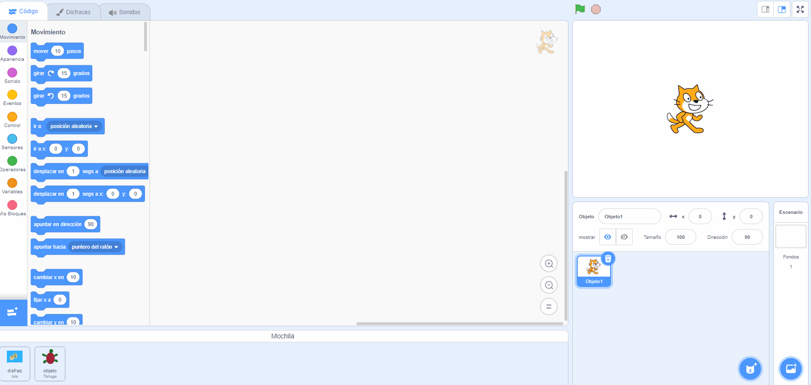

--- /no-print ---

--- print-only ---

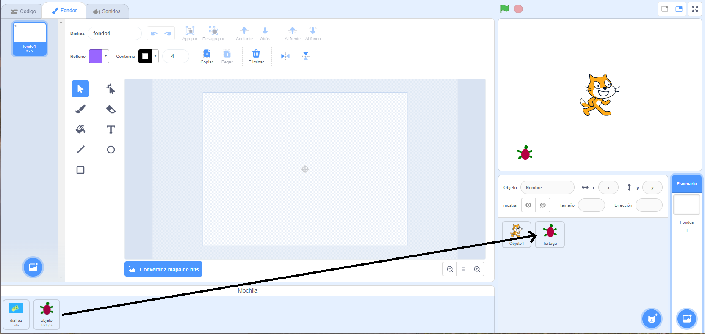

--- /print-only ---

- Para eliminar un artículo, búscalo en la **Mochila**, luego haz clic en él con el botón derecho (o en una tableta, toca y mantén presionado) y selecciona **eliminar**.

--- no-print ---

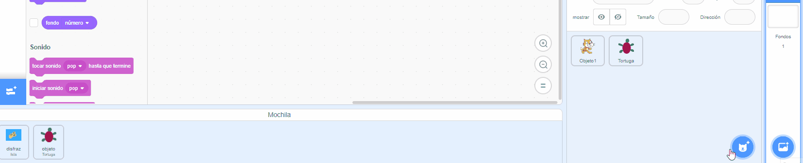

--- /no-print ---

--- print-only ---

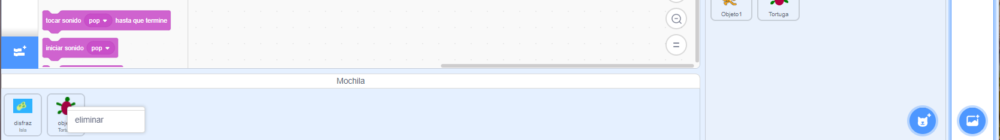

--- /print-only ---

- Puedes ocultarla cuando no la estés usando. Para hacerlo, haz clic en la pestaña **Mochila** en la parte inferior de la pantalla.

--- no-print ---

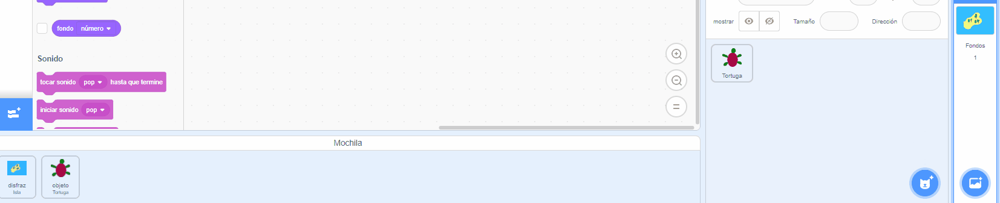

--- /no-print ---

--- print-only ---

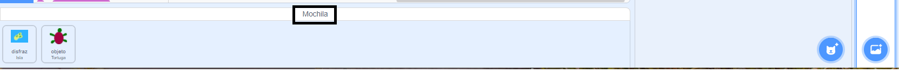

--- /print-only ---
