- Tu peux utiliser ton sac à dos Scratch pour stocker les costumes, les sprites, les sons et les scripts que tu souhaites copier entre les projets.

- Tu ne peux accéder qu'à ton propre sac à dos et tu dois être connecté à ton compte Scratch pour l'utiliser.

- Pour ouvrir ton sac à dos, clique sur l'onglet **Sac à dos** en bas de l'écran.

--- no-print ---

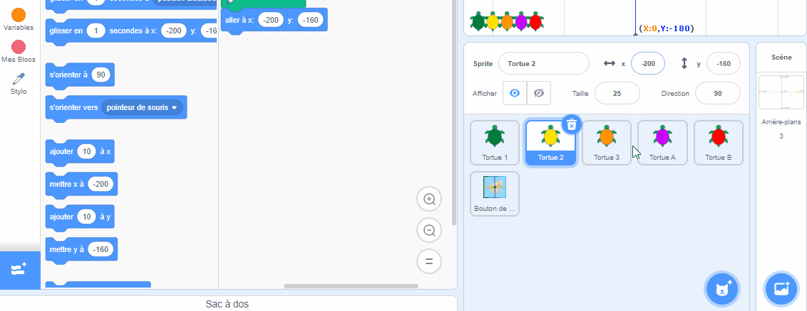

--- /no-print ---

--- print-only ---

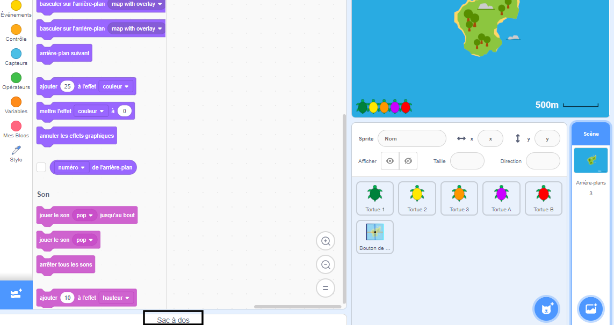

--- /print-only ---

- Pour ajouter un sprite à ton sac à dos, fais glisser le sprite de la liste Sprite vers le sac à dos. Cela stockera le sprite complet dans ton sac à dos, y compris tous ses costumes, sons et scripts.

--- no-print ---

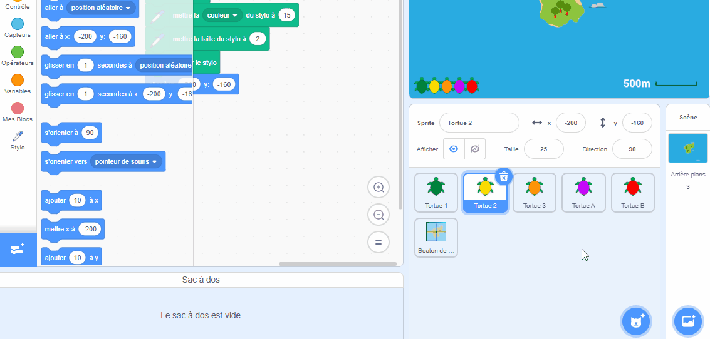

--- /no-print ---

--- print-only ---

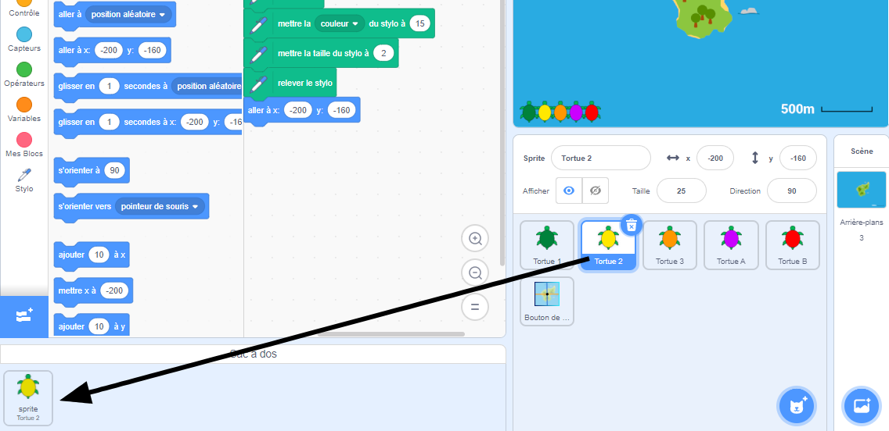

--- /print-only ---

- Pour ajouter un arrière-plan à ton sac à dos, sélectionne le volet Scène et clique sur l'onglet **Arrière-plans** , puis choisis l'arrière-plan que tu souhaites et fais-le glisser vers ton sac à dos.

--- no-print ---

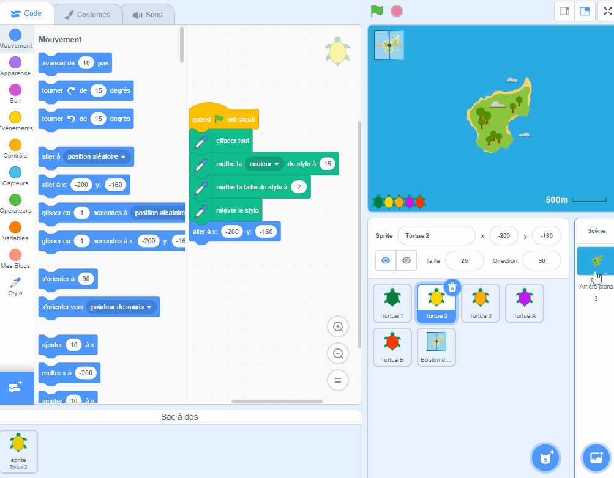

--- /no-print ---

--- print-only ---

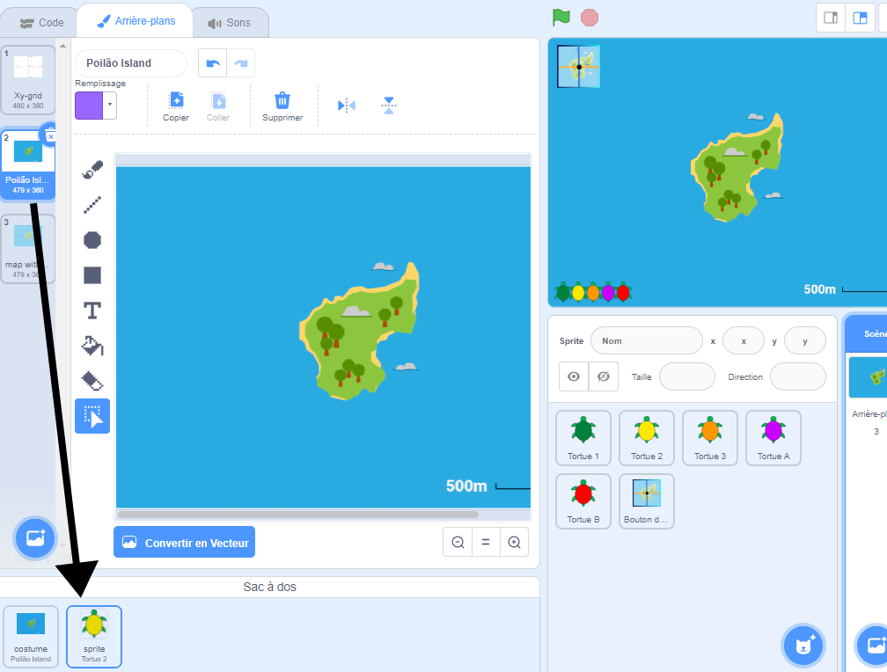

--- /print-only ---

- Pour utiliser un élément de ton sac à dos dans un autre projet, ouvre le projet et fais glisser l'élément du sac à dos vers le volet ou l'onglet approprié.

--- no-print ---

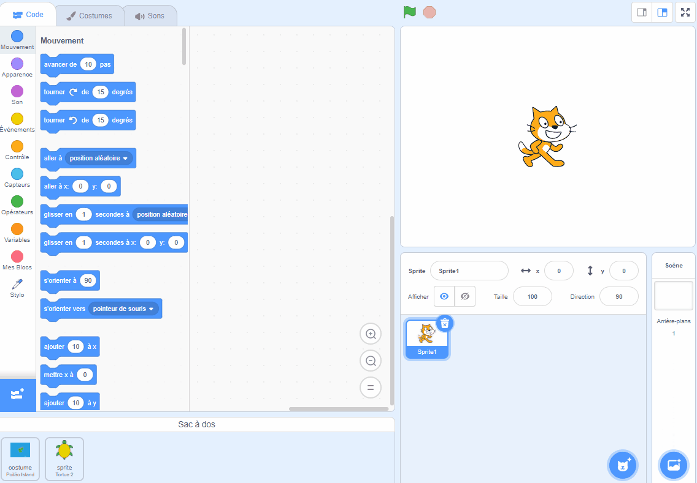

--- /no-print ---

--- print-only ---

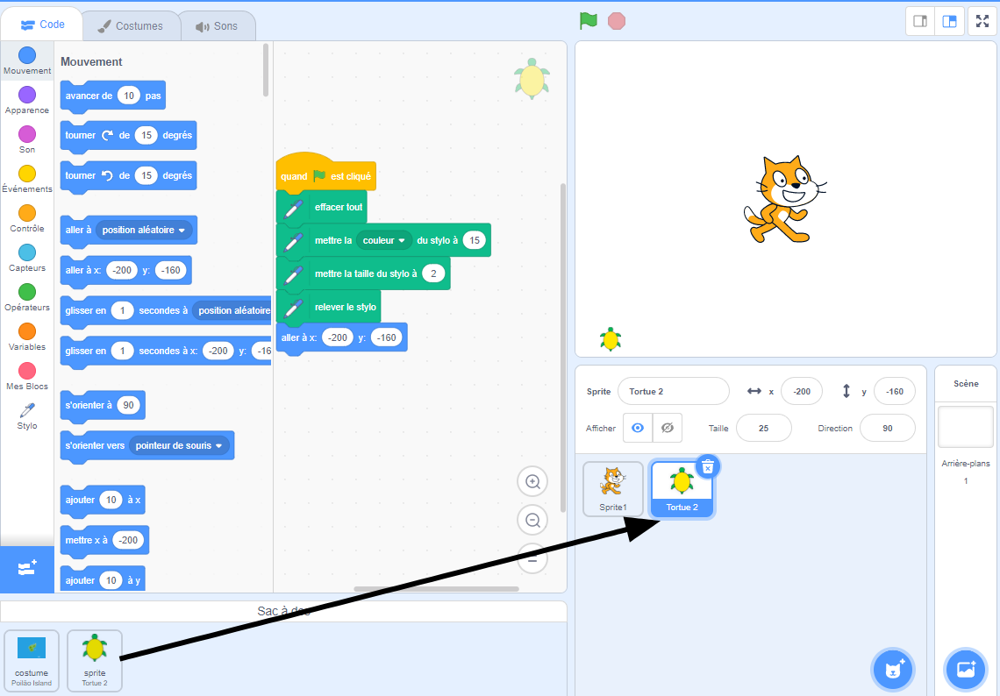

--- /print-only ---

- Pour supprimer un élément de ton sac à dos, recherche l'élément dans l'onglet **Sac à dos**, puis clique avec le bouton droit (ou sur une tablette, maintiens le doigt appuyé) sur l'élément et sélectionne **supprimer**.

--- no-print ---

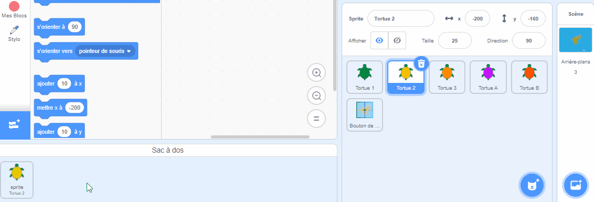

--- /no-print ---

--- print-only ---

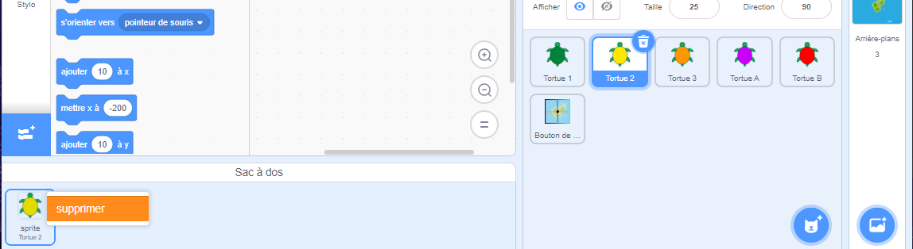

--- /print-only ---

- Tu peux masquer ton sac à dos lorsque tu ne l'utilises pas. Pour cela, clique sur l'onglet **Sac à dos** en bas de l'écran.

--- no-print ---

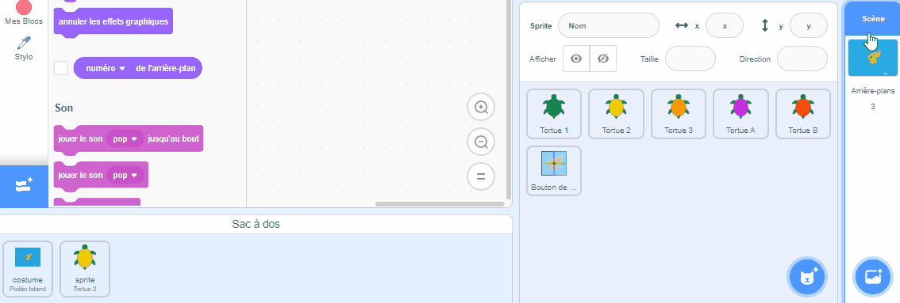

--- /no-print ---

--- print-only ---

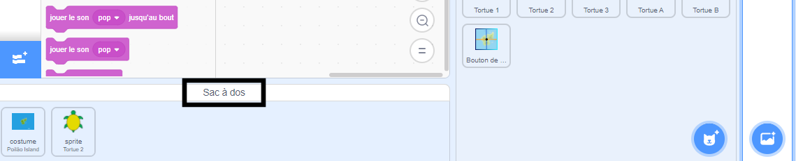

--- /print-only ---
