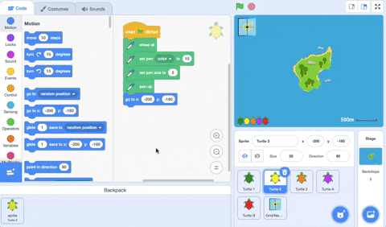
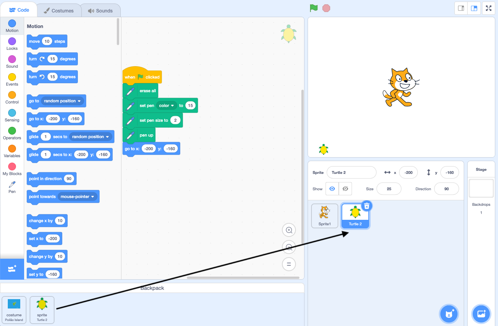

- आप अपने Scratch Backpack का उपयोग उन पोशाकों, स्प्राइट्स, ध्वनियों और स्क्रिप्ट को संग्रहीत करने के लिए कर सकते हैं जिन्हें आप प्रोजेक्ट्स के बीच कॉपी करना चाहते हैं।

- आप केवल अपने स्वयं के Backpack का उपयोग कर सकते हैं, और इसका उपयोग करने के लिए आपको अपने Scratch खाते में लॉग इन करना होगा।

- अपना Backpack खोलने के लिए, स्क्रीन के नीचे **Backpack** टैब पर क्लिक करें।

--- no-print ---

--- /no-print ---

--- print-only ---

--- /print-only ---

- अपने Backpack में स्प्राइट जोड़ने के लिए, स्प्राइट सूची से स्प्राइट को Backpack में खींचें। यह आपके Backpack में पूरे स्प्राइट को स्टोर करेगा, जिसमें इसकी सभी पोशाकें, ध्वनियां और स्क्रिप्ट शामिल हैं।

--- no-print ---

--- /no-print ---

--- print-only ---

--- /print-only ---

- अपने Backpack में एक बैकड्रॉप जोड़ने के लिए, Stage पेन चुनें और **Backdrops** टैब पर क्लिक करें, फिर अपनी इच्छित बैकड्रॉप चुनें और इसे अपने Backpack में खींचें।

--- no-print ---

--- /no-print ---

--- print-only ---

--- /print-only ---

- किसी अन्य प्रोजेक्ट में अपने Backpack में किसी चीज़ का उपयोग करने के लिए, प्रोजेक्ट खोलें और चीज़ को Backpack से सही फलक या टैब पर खींचें।

--- no-print ---

--- /no-print ---

--- print-only ---

--- /print-only ---

- अपने Backpack में किसी चीज़ को हटाने के लिए, **Backpack** टैब में चीज़ ढूंढें, फिर चीज़ पर राइट-क्लिक करें (या टैबलेट पर, टैप करके रखें) और **delete** चुनें ।

--- no-print ---

--- /no-print ---

--- print-only ---

--- /print-only ---

- जब आप इसका उपयोग नहीं कर रहे हों तो आप अपने Backpack को छिपा सकते हैं। ऐसा करने के लिए, स्क्रीन के निचले भाग में **Backpack** टैब पर क्लिक करें।

--- no-print ---

--- /no-print ---

--- print-only ---

--- /print-only ---
