- Puoi utilizzare la Valigetta di Scratch per conservare costumi, sprite, suoni e script che desideri copiare tra progetti.

- Puoi accedere solo alla tua Valigetta e devi aver effettuato l'accesso al tuo account Scratch per utilizzarla.

- Per aprire lo Zaino, fai clic sulla scheda **Valigetta** nella parte inferiore dello schermo.

--- no-print ---

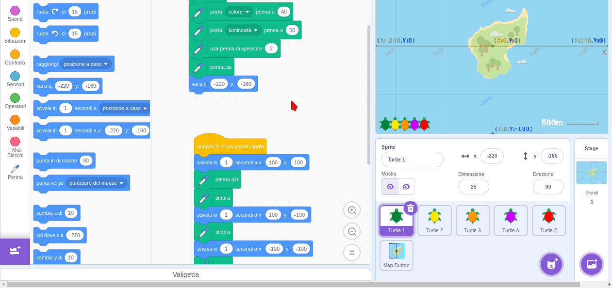

--- /no-print ---

--- print-only ---

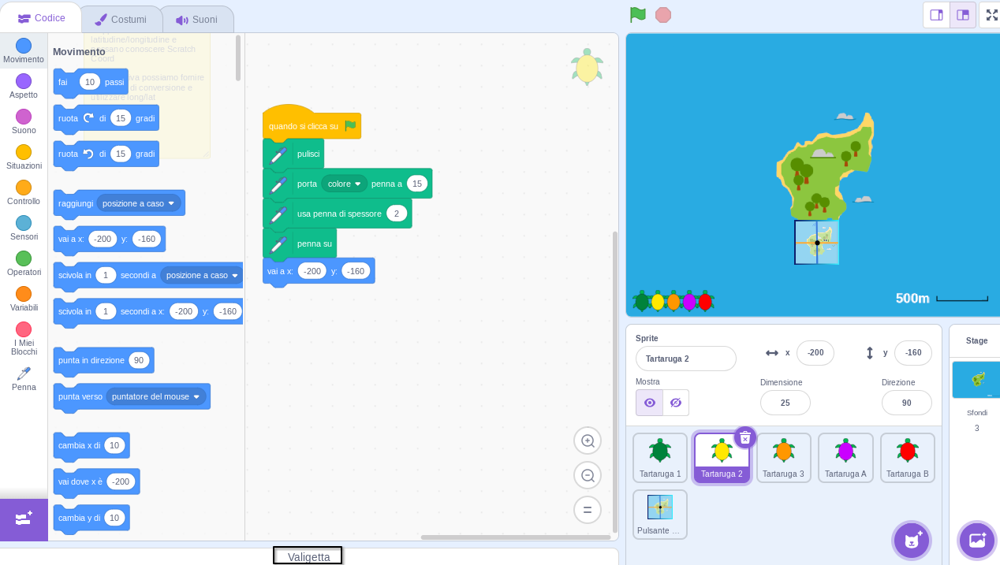

--- /print-only ---

- Per aggiungere uno sprite alla tua Valigetta, trascina lo sprite dall'elenco degli Sprite nella Valigetta. In questo modo conserverai una copia dell'intero sprite nella tua Valigetta, inclusi tutti i suoi costumi, suoni e script.

--- no-print ---

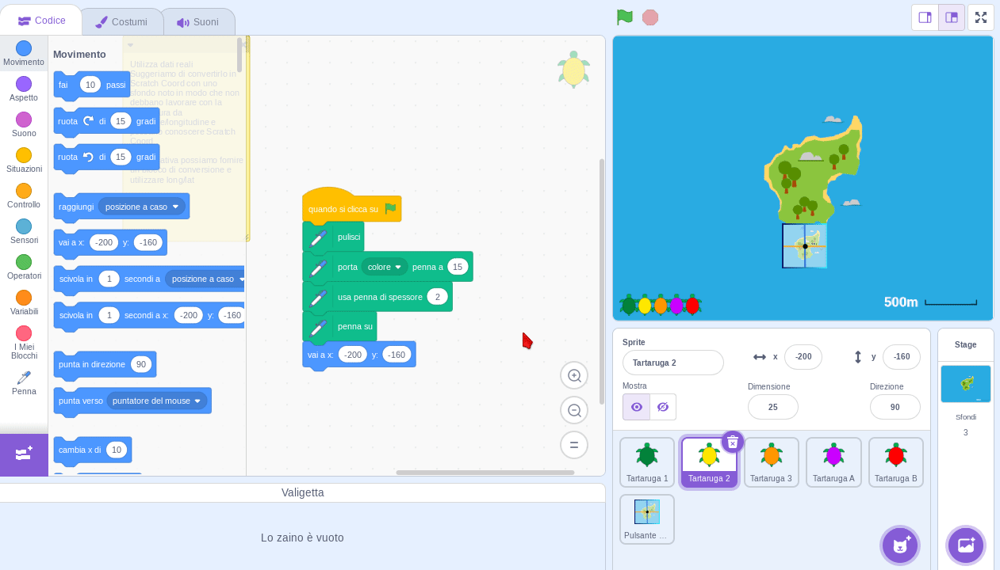

--- /no-print ---

--- print-only ---

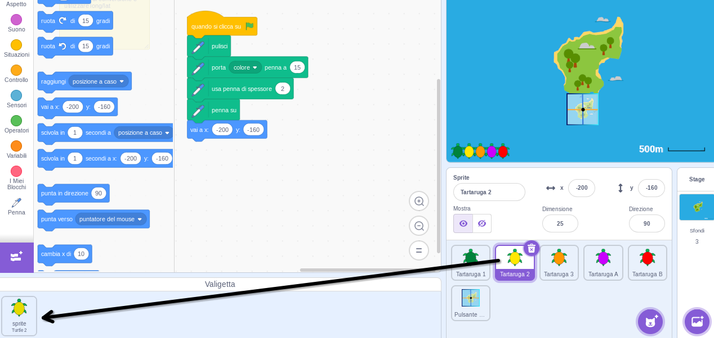

--- /print-only ---

- Per aggiungere uno sfondo alla Valigetta, seleziona il riquadro dello Stage e fai clic sulla scheda **Sfondi**, quindi scegli lo sfondo che desideri e trascinalo nella Valigetta.

--- no-print ---

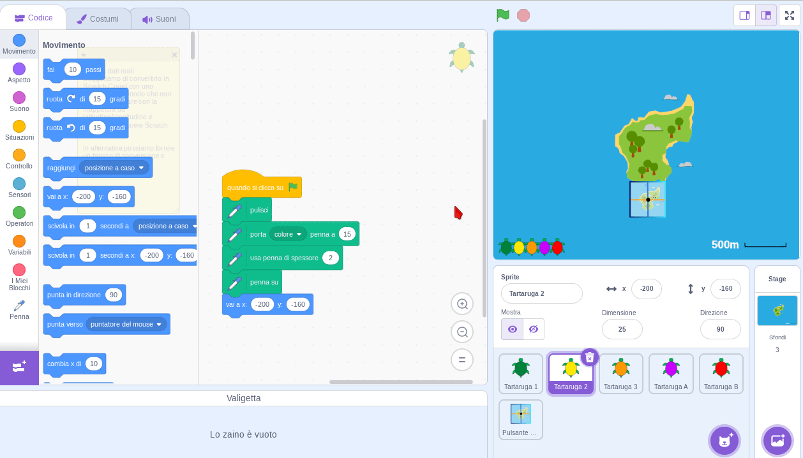

--- /no-print ---

--- print-only ---

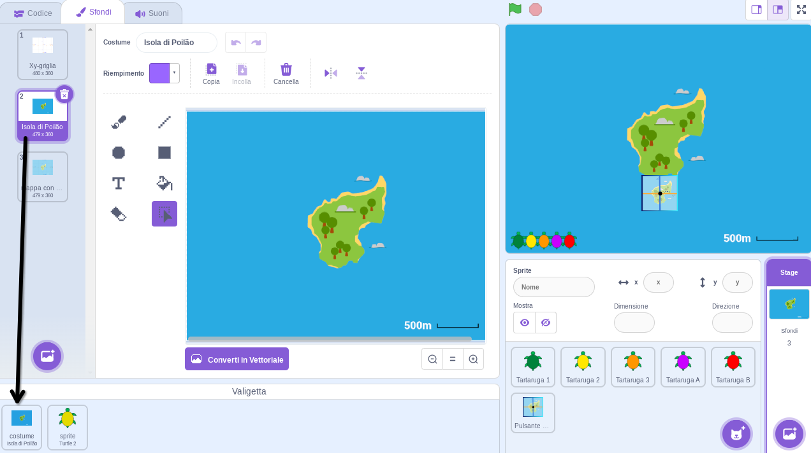

--- /print-only ---

- Per utilizzare un oggetto presente alla Valigetta in un altro progetto; apri il progetto e trascina l'oggetto alla Valigetta nel riquadro o nella scheda corretta.

--- no-print ---

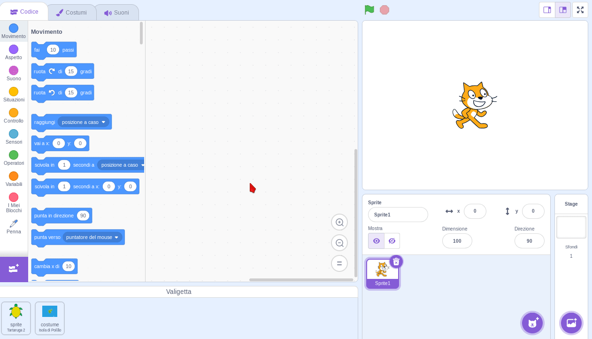

--- /no-print ---

--- print-only ---

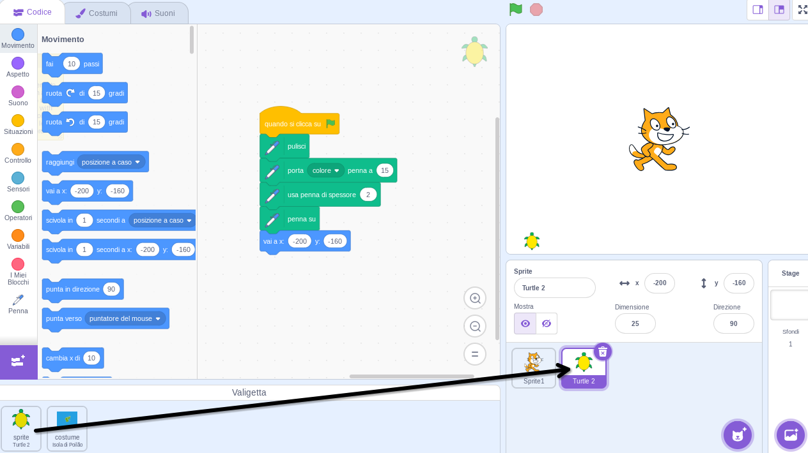

--- /print-only ---

- Per eliminare un oggetto alla Valigetta, cerca l'oggetto nella **Valigetta**, quindi fai clic con il pulsante destro del mouse (o, su un tablet, tocca e tieni premuto) sull'oggetto e seleziona **cancella**.

--- no-print ---

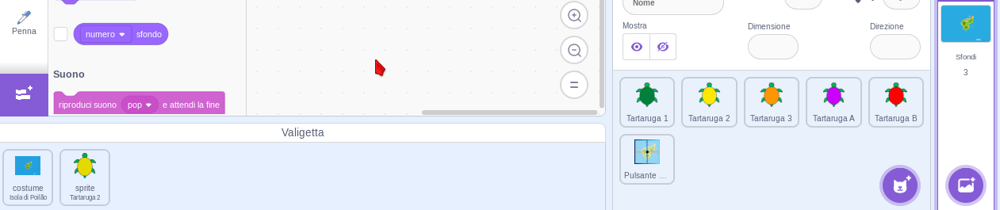

--- /no-print ---

--- print-only ---

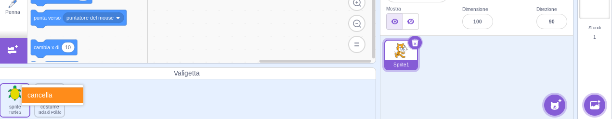

--- /print-only ---

- Puoi nascondere la tua Valigetta quando non la usi. Per farlo, clicca sulla scheda **Valigetta** nella parte inferiore dello schermo.

--- no-print ---

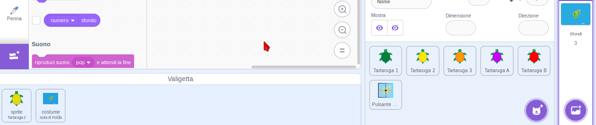

--- /no-print ---

--- print-only ---

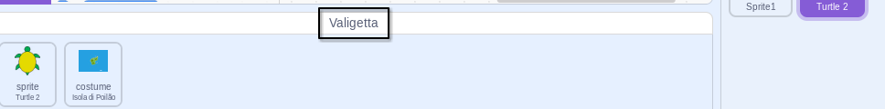

--- /print-only ---
