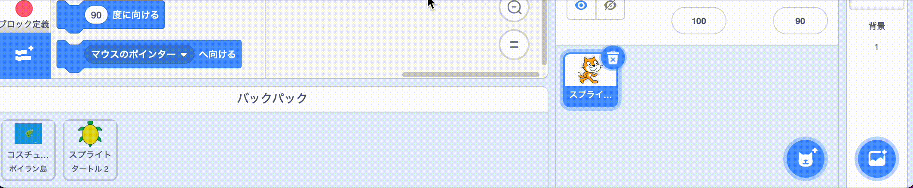

- Scratchのバックパックを使って、コスチューム、スプライト、音、およびスクリプトを保存でき、プロジェクト間でコピーすることができます。

- 自分自身のバックパックにしかアクセスできません。使用するには、Scratchアカウントにログインする必要があります。

- バックパックを開くには、画面の下部にある**バックパック**タブをクリックします。

--- no-print ---

--- /no-print ---

--- print-only ---

--- /print-only ---

- バックパックにスプライトを追加するには、スプライトリストからバックパックにスプライトをドラッグします。 これにより、すべてのコスチューム、音、スクリプトを含むそのスプライトの全てがバックパックに保存されます。

--- no-print ---

--- /no-print ---

--- print-only ---

--- /print-only ---

- バックパックに背景を追加するには、ステージペインを選択し、**背景**タブをクリックしてから、目的の背景を選択してバックパックにドラッグします。

--- no-print ---

--- /no-print ---

--- print-only ---

--- /print-only ---

- 別のプロジェクトでバックパックのアイテムを使用するには、プロジェクトを開き、アイテムをバックパックからアイテムに合ったペインまたはタブにドラッグします。

--- no-print ---

--- /no-print ---

--- print-only ---

--- /print-only ---

- バックパック内のアイテムを削除するには、**バックパック**タブでアイテムを見つけ、アイテムを右クリック（または、タブレットではタップアンドホールド）して**削除**を選択します。

--- no-print ---

--- /no-print ---

--- print-only ---

--- /print-only ---

- バックパックを使用していないときは非表示にすることができます。 これを行うには、画面の下部にある**バックパック**タブをクリックします。

--- no-print ---

--- /no-print ---

--- print-only ---

--- /print-only ---

