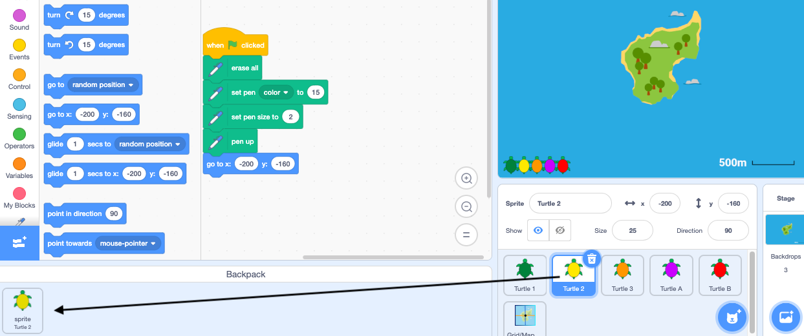

- ನೀವು ನಿಮ್ಮScratch Backpack ನ್ನು ಪ್ರಾಜೆಕ್ಟ್‌ಗಳ ನಡುವೆ ಉಪಯೋಗಿಸಲು ಬಯಸುವ ಉಡುಪುಗಳು, ಸ್ಪ್ರೈಟ್‌ಗಳು, ಧ್ವನಿಗಳು ಮತ್ತು ಬರಹಗಳನ್ನು ಸಂಗ್ರಹಿಸಲು ಉಪಯೋಗಿಸಬಹುದು.

- ನೀವು ನಿಮ್ಮ ಸ್ವಂತ Backpack ನ್ನು ಮಾತ್ರ ಪ್ರವೇಶಿಸಬಹುದು, ಮತ್ತು ಅಸನ್ನು ಉಪಯೋಗಿಸಲು ನೀವು ನಿಮ್ಮ Scratch ಖಾತೆಗೆ ಲಾಗ್‌ಇನ್‌ ಆಗಿರಲೇಬೇಕು.

- ನಿಮ್ಮ Backpack ನ್ನು ತೆರೆಯಲು, ಪರದೆಯ ಕೆಳಗೆ ಇರುವ **Backpack** ಟ್ಯಾಬ್‌ ಮೇಲೆ ಕ್ಲಿಕ್‌ ಮಾಡಿ.

--- no-print ---

--- /no-print ---

--- print-only ---

--- /print-only ---

- ನಿಮ್ಮ Backpack ಗೆ ಸ್ಪ್ರೈಟ್‌ ಸೇರಿಸಲು, Sprite ಲಿಸ್ಟ್‌ನಿಂದ ಸ್ಪ್ರೈಟ್‌ನ್ನು Backpack ಗೆ ಎಳೆಯಿರಿ. ಇದು ಸಂಪೂರ್ಣ ಸ್ಪ್ರೈಟ್‌ನ್ನು ನಿಮ್ಮ Backpack ನಲ್ಲಿ ಸಂಗ್ರಹಿಸುತ್ತದೆ, ಅದರ ಎಲ್ಲಾ ಉಡುಪುಗಳು, ಧ್ವನಿಗಳು, ಮತ್ತು ಬರಹಗಳನ್ನು ಸೇರಿಸಿ.

--- no-print ---

--- /no-print ---

--- print-only ---

--- /print-only ---

- ನಿಮ್ಮ Backpack ಗೆ ಹಿನ್ನೆಲೆಯನ್ನು ಸೇರಿಸಲು, Stage ಪೇನ್‌ನ್ನು ಆಯ್ಕೆ ಮಾಡಿ ಮತ್ತು **Backdrops** ಟ್ಯಾಬ್‌ ಮೇಲೆ ಕ್ಲಿಕ್‌ ಮಾಡಿ, ನಂತರ ನಿಮಗೆ ಬೇಕಾದ ಹಿನ್ನಲೆಯನ್ನು ಆಯ್ಕೆ ಮಾಡಿ ಅದನ್ನು Backpack ಗೆ ಎಳೆಯಿರಿ.

--- no-print ---

--- /no-print ---

--- print-only ---

--- /print-only ---

- ಇನ್ನೊಂದು ಪ್ರಾಜೆಕ್ಟ್‌ನಲ್ಲಿ ನಿಮ್ಮ Backpack ನಲ್ಲಿರುವ ಒಂದು ವಸ್ತುವನ್ನು ಉಪಯೋಗಿಸಲು, ಪ್ರಾಜೆಕ್ಟ್‌ನ್ನು ತೆರೆಯಿರಿ ಮತ್ತು ವಸ್ತುವನ್ನು Backpack ನಿಂದ ಸರಿಯಾದ ಪೇನ್‌ ಅಥವಾ ಟ್ಯಾಬ್‌ಗೆ ಎಳೆಯಿರಿ.

--- no-print ---

--- /no-print ---

--- print-only ---

--- /print-only ---

- ನಿಮ್ಮ Backpack ನಲ್ಲಿರುವ ವಸ್ತುವನ್ನು ಅಳಿಸಲು, **Backpack** ಟ್ಯಾಬ್‌ನಲ್ಲಿರುವ ವಸ್ತುವನ್ನು ಪತ್ತೆ ಮಾಡಿ, ನಂತರ ವಾತುವಿನ ಮೇಲೆ ರೈಟ್-ಕ್ಲಿಕ್‌ ಮಾಡಿ (ಅಥವಾ ಟ್ಯಾಬ್ಲೆಟ್‌ನಲ್ಲಿ ಟ್ಯಾಪ್‌ ಮಾಡಿ ಹಿಡಿದುಕೊಳ್ಳಿ) ಮತ್ತು **delete** ಆಯ್ಕೆಮಾಡಿಕೊಳ್ಳಿ.

--- no-print ---

--- /no-print ---

--- print-only ---

--- /print-only ---

- ನೀವು ಉಪಯೋಗಿಸದೇ ಇರುವಾಗ, ನಿಮ್ಮ Backpack ನ್ನು ಮರೆಮಾಡಿ. ಇದನ್ನು ಮಾಡಲು, ಪರದೆಯ ಕೆಳಗಡೆ ಇರುವ **Backpack** ಟ್ಯಾಬ್‌ ಮೇಲೆ ಕ್ಲಿಕ್‌ ಮಾಡಿ.

--- no-print ---

--- /no-print ---

--- print-only ---

--- /print-only ---
