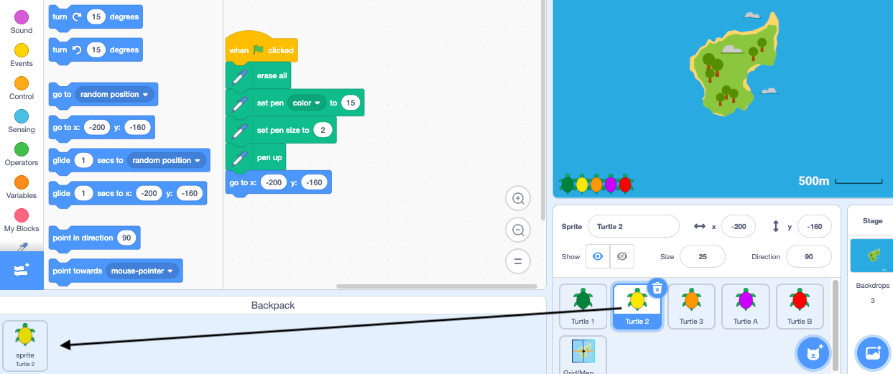
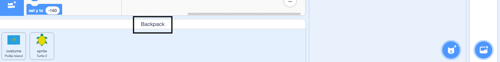

- तुम्ही तुमच्या Scratch Backpack चा वापर costumes, sprites, sounds, आणि scripts ज्या प्रोजेक्ट दरम्यान तुम्हाला कॉपी करायच्या आहेत त्या स्टोअर करण्यासाठी वापर करू शकता.

- तुम्ही केवळ स्वतःचा Backpack वापरू शकता, आणि तुम्ही तो वापरण्यासाठी तुमच्या Scratch अकाऊंटमध्ये लॉग इन करायला हवे.

- तुमचे Backpack उघडण्यासाठी, स्क्रीनच्या खालील **Backpack** टॅबवर क्लिक करा.

--- no-print ---

--- /no-print ---

--- print-only ---

--- /print-only ---

- तुमच्या Backpack ला स्प्राईट जोडण्यासाठी, Sprite लीस्ट मधून Backpack ला स्प्राईट ड्रॅग करा. हे तुमच्या Backpack मध्ये पुर्ण sprite स्टोअर करेल, ज्यामध्ये costumes, sounds, आणि scripts असतील.

--- no-print ---

--- /no-print ---

--- print-only ---

--- /print-only ---

- तुमच्या Backpack ला बॅकड्रॉप जोडण्यासाठी, Stage पेन निवडा आणि **Backdrops** टॅबवर क्लिक करा, त्यानंतर तुम्हाला हवा तो बॅकड्रॉप निवडा आणि तुमच्या Backpack ड्रॅग करा.

--- no-print ---

--- /no-print ---

--- print-only ---

--- /print-only ---

- तुमच्या Backpack मधील आयटम दुसऱ्या प्रोजेक्टमध्ये वापरण्यासाठी, प्रोजेक्ट उघडा आणि Backpack मधून आयटम योग्य पेन किंवा टॅबमध्ये ड्रॅग करा.

--- no-print ---

--- /no-print ---

--- print-only ---

--- /print-only ---

- तुमच्या Backpack मधील आयटम डिलीट करण्यासाठी, **Backpack** टॅब मधील आयटम शोधा, त्यानंतर आयटमवर राईट क्लिक करा (किंवा टॅबलेट, टॅप आणि होल्ड करा) आणि निवडा **delete**.

--- no-print ---

--- /no-print ---

--- print-only ---

--- /print-only ---

- तुम्ही वापरत नसलात त्यावेळी तुमचा Backpack लपवू शकता. हे करण्यासाठी, स्क्रीनच्या खालील **Backpack** टॅबवर क्लिक करा.

--- no-print ---

--- /no-print ---

--- print-only ---

--- /print-only ---
