- Je kunt je Scratch-rugzak gebruiken om uiterlijken, sprites, geluiden en scripts op te slaan die je tussen projecten wilt kopiëren.

- Je hebt alleen toegang tot je eigen rugzak en je moet ingelogd zijn op je Scratch-account om het te gebruiken.

- Om je rugzak te openen, klik je op **Rugzak** onderaan het scherm.

--- no-print ---

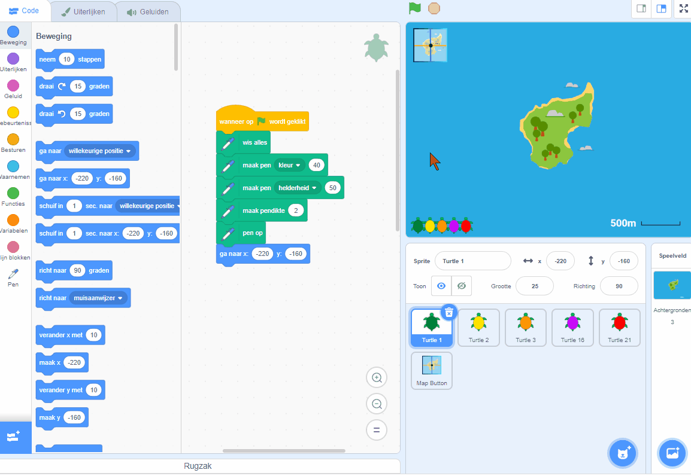

--- /no-print ---

--- print-only ---

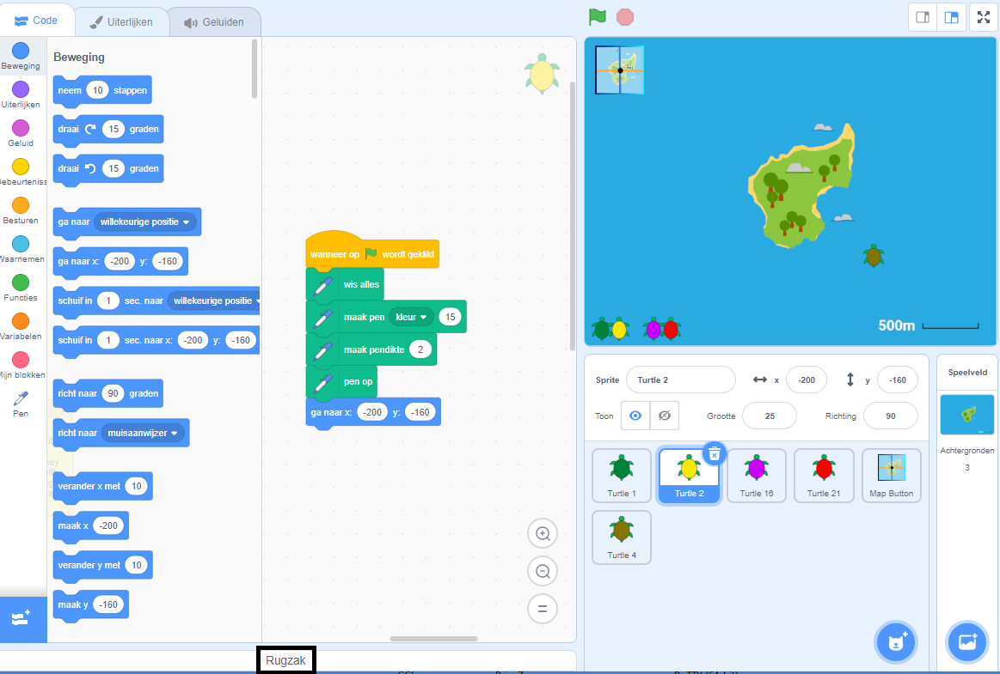

--- /print-only ---

- Om een sprite aan je rugzak toe te voegen, sleep je de sprite van de sprite-lijst naar de rugzak. Hiermee wordt de volledige sprite in je rugzak opgeslagen, inclusief alle uiterlijken, geluiden en scripts.

--- no-print ---

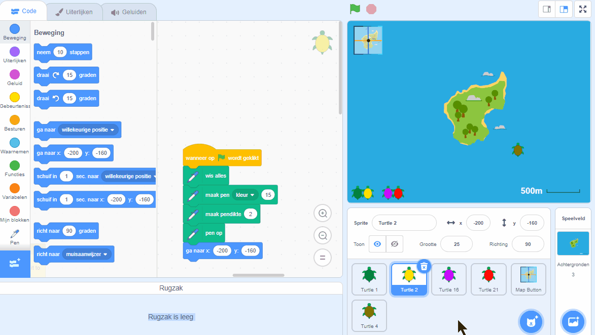

--- /no-print ---

--- print-only ---

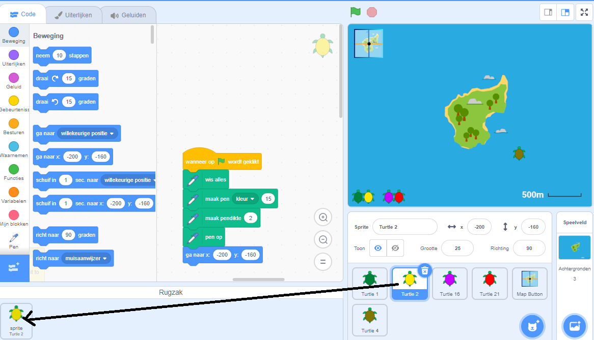

--- /print-only ---

- Om een achtergrond aan je rugzak toe te voegen, selecteer je het speelveld-paneel en klik je op **Achtergronden** en kies dan je de achtergrond die je wilt en sleep je deze naar je rugzak.

--- no-print ---

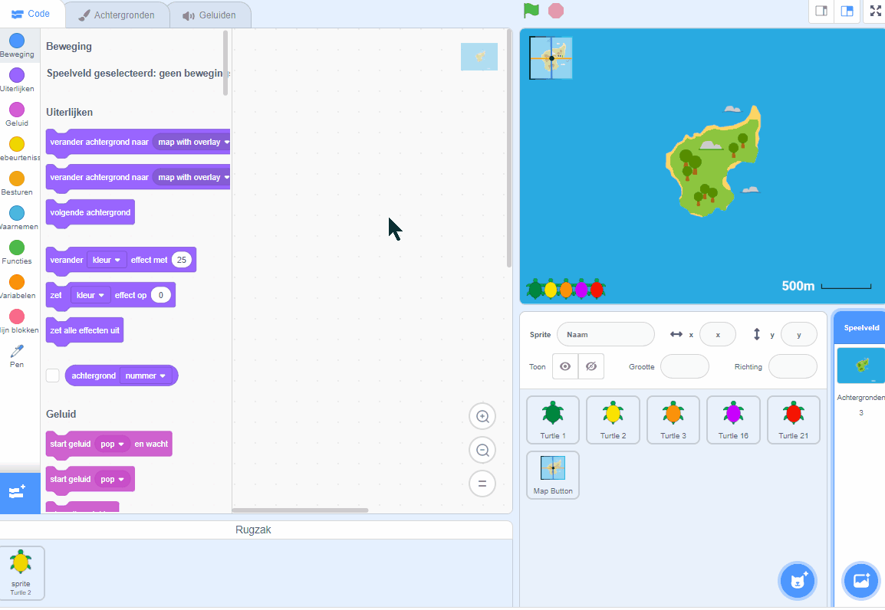

--- /no-print ---

--- print-only ---

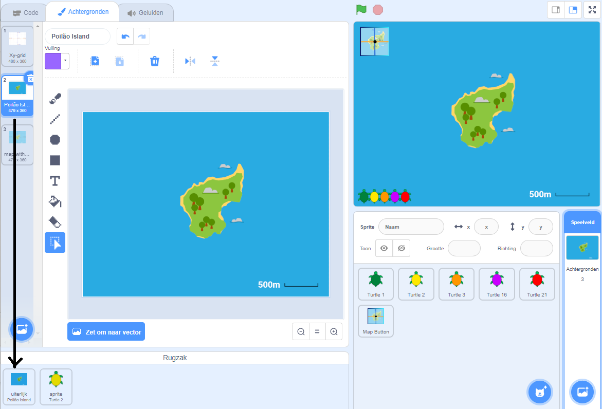

--- /print-only ---

- To use an item in your Backpack in another project, open the project and drag the item from the Backpack to the correct pane or tab.

--- no-print ---

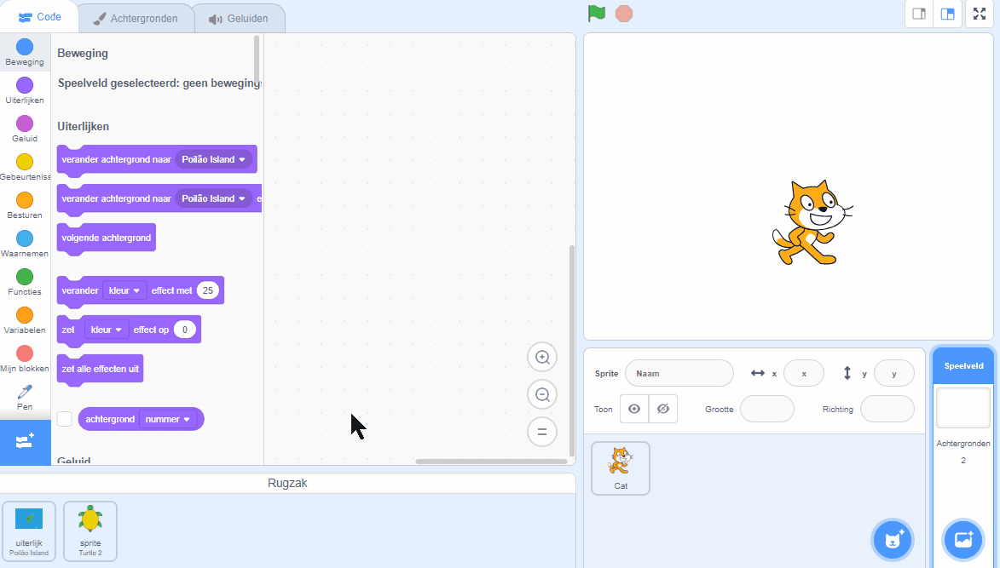

--- /no-print ---

--- print-only ---

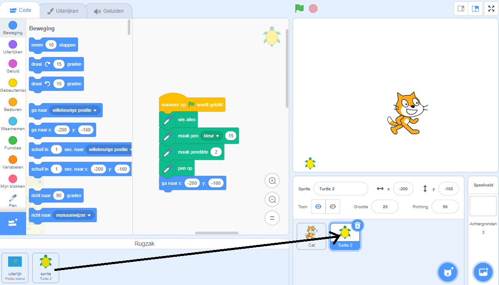

--- /print-only ---

- To delete an item in your Backpack, find the item in the **Backpack** tab, then right-click (or on a tablet, tap and hold) on the item and select **delete**.

--- no-print ---

--- /no-print ---

--- print-only ---

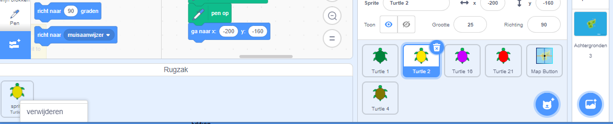

--- /print-only ---

- You can hide your Backpack when you are not using it. To do this, click on the **Backpack** tab at the bottom of the screen.

--- no-print ---

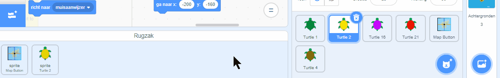

--- /no-print ---

--- print-only ---

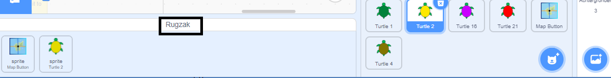

--- /print-only ---
