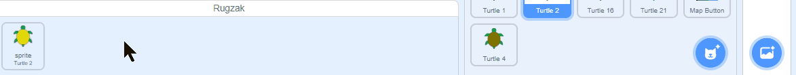

- Je kunt je Scratch-rugzak gebruiken om uiterlijken, sprites, geluiden en scripts op te slaan die je tussen projecten wilt kopiëren.

- Je hebt alleen toegang tot je eigen rugzak en je moet ingelogd zijn op je Scratch-account om het te gebruiken.

- Om je rugzak te openen, klik je op **Rugzak** onderaan het scherm.

--- no-print ---

--- /no-print ---

--- print-only ---

--- /print-only ---

- Om een sprite aan je rugzak toe te voegen, sleep je de sprite van de sprite-lijst naar de rugzak. Hiermee wordt de volledige sprite in je rugzak opgeslagen, inclusief alle uiterlijken, geluiden en scripts.

--- no-print ---

--- /no-print ---

--- print-only ---

--- /print-only ---

- Om een achtergrond aan je rugzak toe te voegen, selecteer je het speelveld-paneel en klik je op **Achtergronden** en kies dan je de achtergrond die je wilt en sleep je deze naar je rugzak.

--- no-print ---

--- /no-print ---

--- print-only ---

--- /print-only ---

- Om een item in je rugzak in een ander project te gebruiken, open je het project en sleep je het item van de rugzak naar het juiste paneel of tabblad.

--- no-print ---

--- /no-print ---

--- print-only ---

--- /print-only ---

- Om een item in je rugzak te verwijderen, zoek je het item op je **Rugzak** tabblad, klik je met de rechtermuisknop (of tik op een tablet en houd het vast) op het item en selecteer je **verwijderen**.

--- no-print ---

--- /no-print ---

--- print-only ---

--- /print-only ---

- Je kunt je rugzak verbergen als je hem niet gebruikt. Klik hiervoor op de **Rugzak** tab onderaan het scherm.

--- no-print ---

--- /no-print ---

--- print-only ---

--- /print-only ---
