- Możesz użyć plecaka w Scratch do przechowywania kostiumów, duszków, dźwięków i skryptów, które chcesz kopiować między projektami.

- Możesz uzyskać dostęp tylko do własnego Plecaka i musisz być zalogowany na swoje konto Scratch, aby z niego korzystać.

- Aby otworzyć plecak, kliknij kartę **Plecak** u dołu ekranu.

--- no-print ---

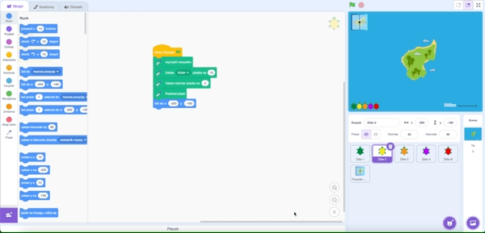

--- /no-print ---

--- print-only ---

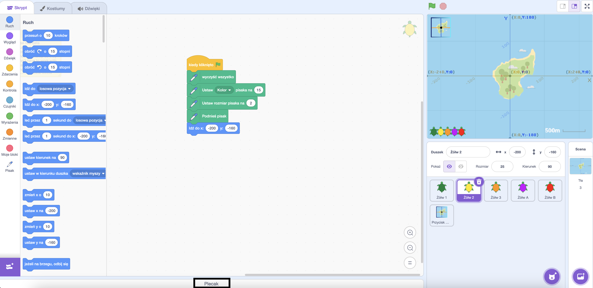

--- /print-only ---

- Aby dodać duszka do plecaka, przeciągnij duszka z listy duszków do plecaka. Spowoduje to przechowanie pełnego duszka w plecaku, w tym wszystkich jego kostiumów, dźwięków i skryptów.

--- no-print ---

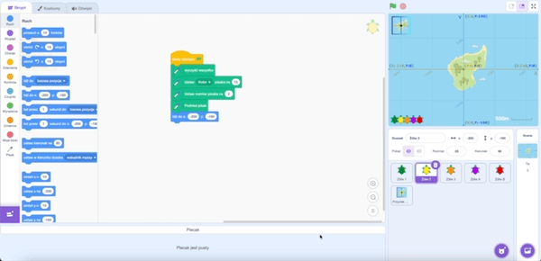

--- /no-print ---

--- print-only ---

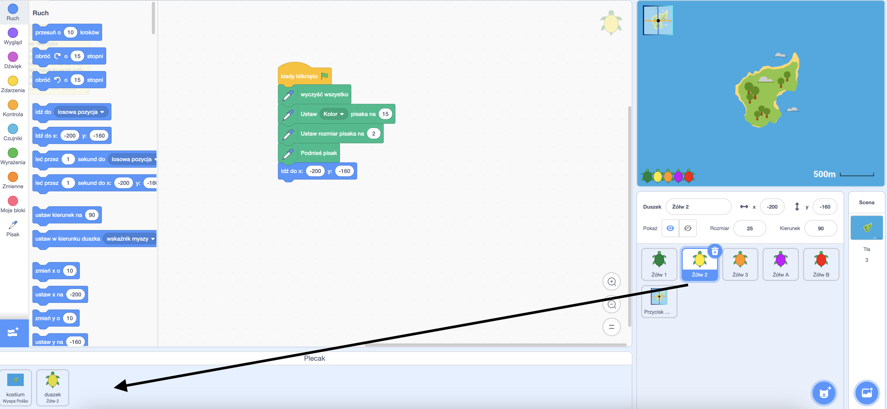

--- /print-only ---

- Aby dodać tło do plecaka, wybierz panel Scena i kliknij kartę **Tła**, a następnie wybierz żądane tło i przeciągnij je do plecaka.

--- no-print ---

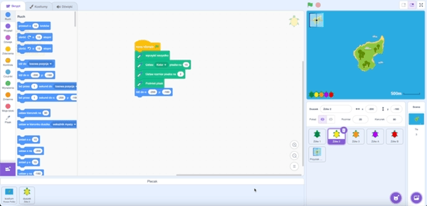

--- /no-print ---

--- print-only ---

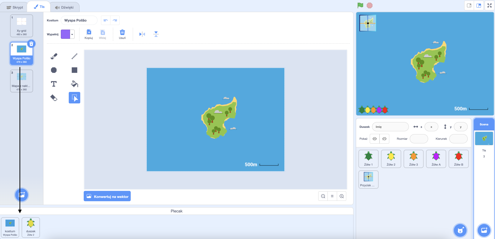

--- /print-only ---

- Aby użyć przedmiotu z plecaka w innym projekcie, otwórz projekt i przeciągnij przedmiot z plecaka do odpowiedniego panelu lub karty.

--- no-print ---

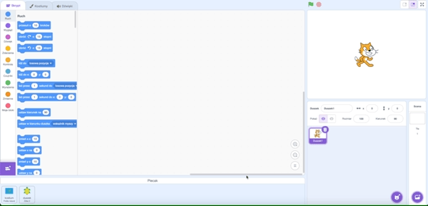

--- /no-print ---

--- print-only ---

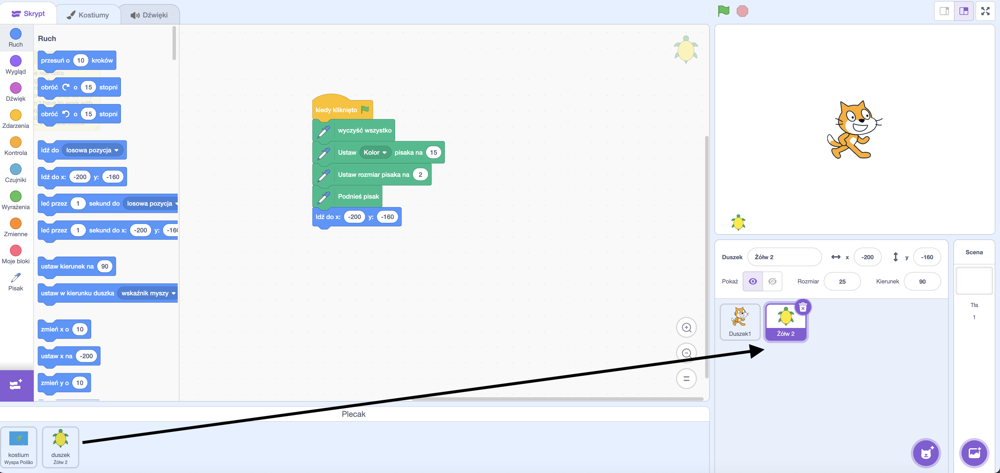

--- /print-only ---

- Aby usunąć przedmiot z plecaka, znajdź przedmiot na karcie **Plecak**, a następnie kliknij go prawym przyciskiem myszy (lub na tablecie naciśnij i przytrzymaj) i wybierz opcję **usuń**.

--- no-print ---

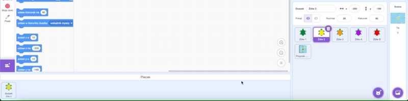

--- /no-print ---

--- print-only ---

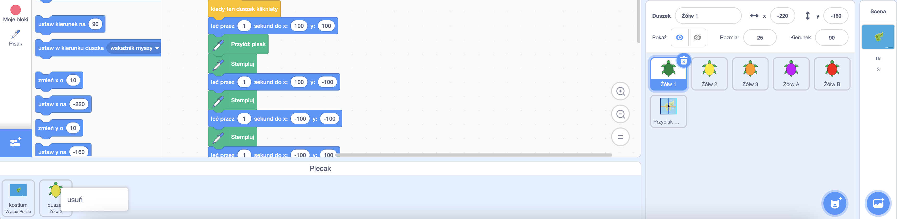

--- /print-only ---

- Możesz ukryć swój plecak, gdy go nie używasz. Aby to zrobić, kliknij zakładkę **Plecak** u dołu ekranu.

--- no-print ---

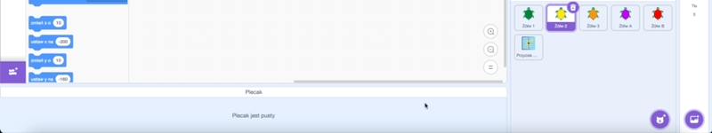

--- /no-print ---

--- print-only ---

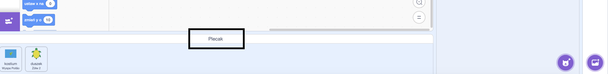

--- /print-only ---
