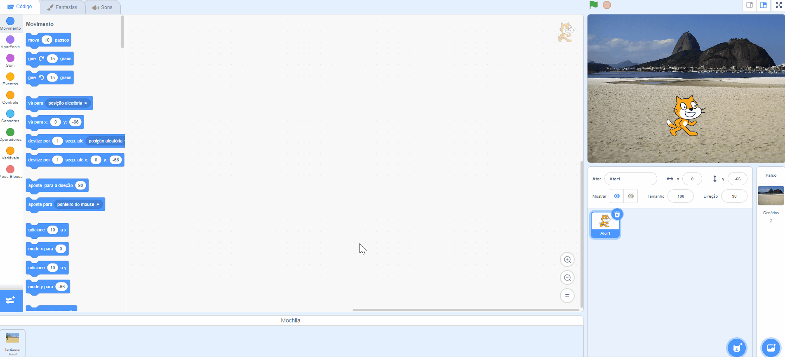

- Você pode usar sua Mochila Scratch para armazenar fantasias, atores, sons e scripts que deseja copiar entre projetos.

- Você só pode acessar sua própria mochila e deve estar logado na sua conta do Scratch para usá-la.

- Para abrir sua Mochila, clique na aba **Mochila** na parte inferior da tela.

--- no-print ---

--- /no-print ---

--- print-only ---

--- /print-only ---

- Para adicionar um ator à sua mochila, arraste o ator da lista Ator para a mochila. Isso armazenará o ator completo em sua mochila, incluindo todos os seus trajes, sons e scripts.

--- no-print ---

--- /no-print ---

--- print-only ---

--- /print-only ---

- Para adicionar um pano de fundo à sua mochila, selecione o painel Palco e clique na guia **Panos de fundo** , depois escolha o pano de fundo desejado e arraste-o para sua mochila.

--- no-print ---

--- /no-print ---

--- print-only ---

--- /print-only ---

- Para usar um item em sua mochila em outro projeto, abra o projeto e arraste o item da mochila para o painel ou guia correto.

--- no-print ---

--- /no-print ---

--- print-only ---

--- /print-only ---

- Para excluir um item da sua Mochila, localize o item na guia **Mochila** , clique com o botão direito do mouse (ou em um tablet, toque e segure) no item e selecione **excluir**.

--- no-print ---

--- /no-print ---

--- print-only ---

--- /print-only ---

- Você pode ocultar sua mochila quando não a estiver usando. Para fazer isso, clique na guia **Backpack** na parte inferior da tela.

--- no-print ---

--- /no-print ---

--- print-only ---

--- /print-only ---
