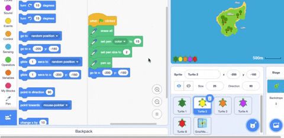
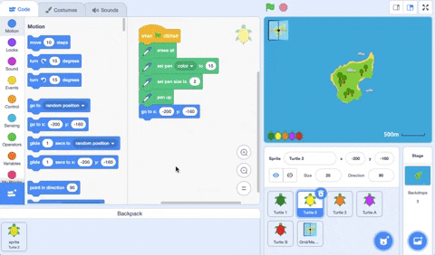
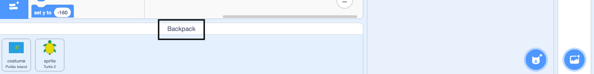

- మీరు ప్రాజెక్ట్‌ల మధ్య కాపీ చేయాలనుకుంటున్న costumes, sprites, sounds మరియు scripts నిల్వ చేయడానికి మీ Scratch Backpack ని ఉపయోగించవచ్చు.

- మీరు మీ స్వంత Backpack ను మాత్రమే యాక్సెస్ చేయగలరు మరియు దాన్ని ఉపయోగించడానికి మీరు తప్పనిసరిగా మీ Scratch ఖాతాకు లాగిన్ అయి ఉండాలి.

- మీ Backpack ను తెరవడానికి, స్క్రీన్ దిగువన ఉన్న **Backpack** ట్యాబ్‌పై క్లిక్ చేయండి.

--- no-print ---

--- /no-print ---

--- print-only ---

--- /print-only ---

- మీ Backpackకి sprite ను జోడించడానికి, sprite జాబితా నుండి Backpack Sprite ను డ్రాగ్ చేయండి. ఇది మీ Backpack దాని costumes, sounds, మరియు scripts సహా పూర్తి sprite ను నిల్వ చేస్తుంది.

--- no-print ---

--- /no-print ---

--- print-only ---

--- /print-only ---

- మీ Backpack కి బ్యాక్‌డ్రాప్ జోడించడానికి, Stage పేన్‌ని ఎంచుకుని, **Backdrops** ట్యాబ్‌పై క్లిక్ చేసి, ఆపై మీకు కావలసిన బ్యాక్‌డ్రాప్‌ను ఎంచుకుని, దాన్ని మీ Backpack కి డ్రాగ్ చేయండి.

--- no-print ---

--- /no-print ---

--- print-only ---

--- /print-only ---

- మరొక ప్రాజెక్ట్‌లో మీ Backpack లోని అంశాన్ని ఉపయోగించడానికి, ప్రాజెక్ట్‌ను తెరిచి, అంశాన్ని Backpack నుండి సరైన పేన్ లేదా ట్యాబ్‌కు లాగండి.

--- no-print ---

--- /no-print ---

--- print-only ---

--- /print-only ---

- మీ Backpack లోని ఐటెమ్‌ను తొలగించడానికి, **Backpack** ట్యాబ్‌లో ఐటెమ్‌ను కనుగొని, ఆపై ఐటెమ్‌పై రైట్-క్లిక్ (లేదా టాబ్లెట్‌లో, నొక్కి, పట్టుకోండి) ఆపై **delete** ని ఎంచుకోండి.

--- no-print ---

--- /no-print ---

--- print-only ---

--- /print-only ---

- మీరు మీ Backpack ని ఉపయోగించనప్పుడు దాన్ని దాచవచ్చు. దీన్ని చేయడానికి, స్క్రీన్ దిగువన ఉన్న **Backpack** ట్యాబ్‌పై క్లిక్ చేయండి.

--- no-print ---

--- /no-print ---

--- print-only ---

--- /print-only ---
