- Ти можеш використовувати свій Scratch Сховок для зберігання образів, спрайтів, звуків та скриптів, які ти хочеш скопіювати між проєктами.

- Ти можеш отримати доступ лише для свого Сховку, і для того, щоб ним користуватися, ти маєш увійти до свого облікового запису Scratch.

- Щоб відкрити Сховок, натисни на вкладку **Сховок** внизу екрану.

--- no-print ---

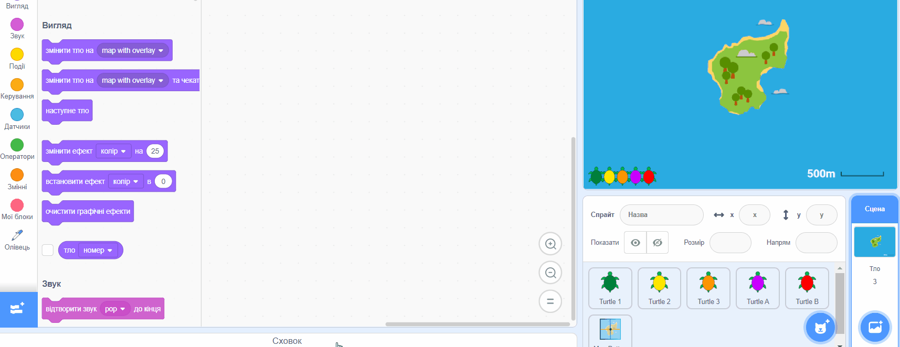

--- /no-print ---

--- print-only ---

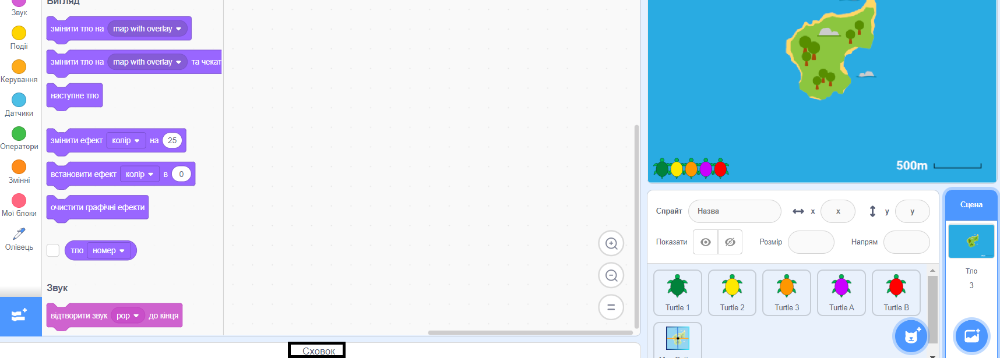

--- /print-only ---

- Щоб додати спрайт у Сховок, перетягни його зі списку Спрайтів у Сховок. Це дозволить зберігати весь спрайт у твоєму Сховку, включаючи всі його образи, звуки та скрипти.

--- no-print ---

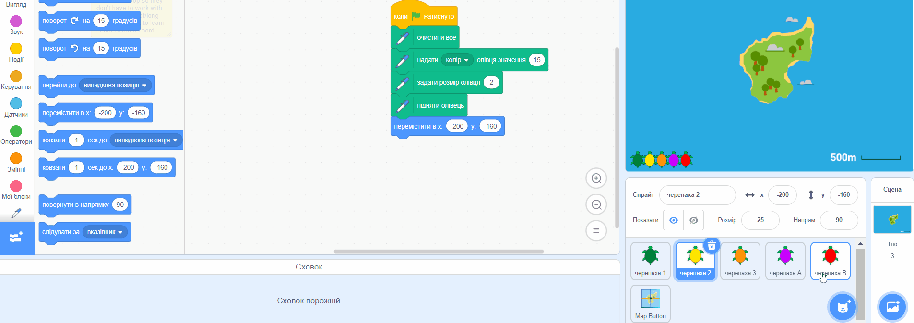

--- /no-print ---

--- print-only ---

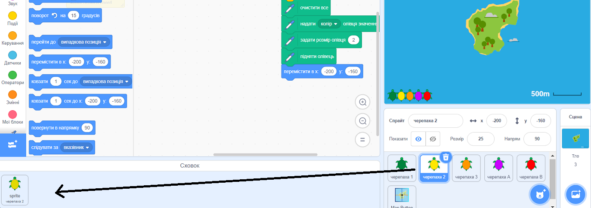

--- /print-only ---

- Щоб додати тло у Сховок, вибери вкладку Сцена та натисни на вкладку **Тло**, потім вибери потрібне тло та перетягни його у Сховок.

--- no-print ---

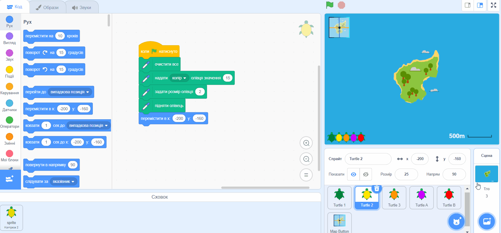

--- /no-print ---

--- print-only ---

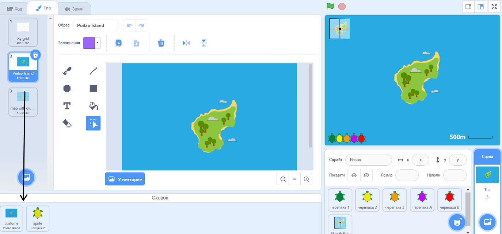

--- /print-only ---

- Щоб використовувати вміст Сховку в іншому проєкті, відкрий проєкт та перетягни потрібний елемент зі Сховку на відповідну панель або вкладку.

--- no-print ---

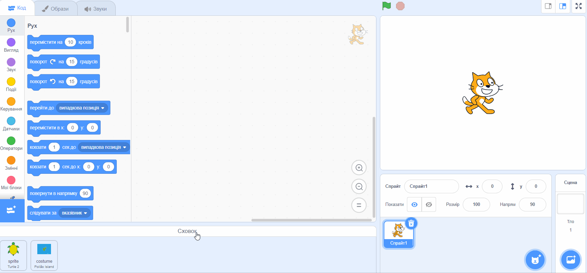

--- /no-print ---

--- print-only ---

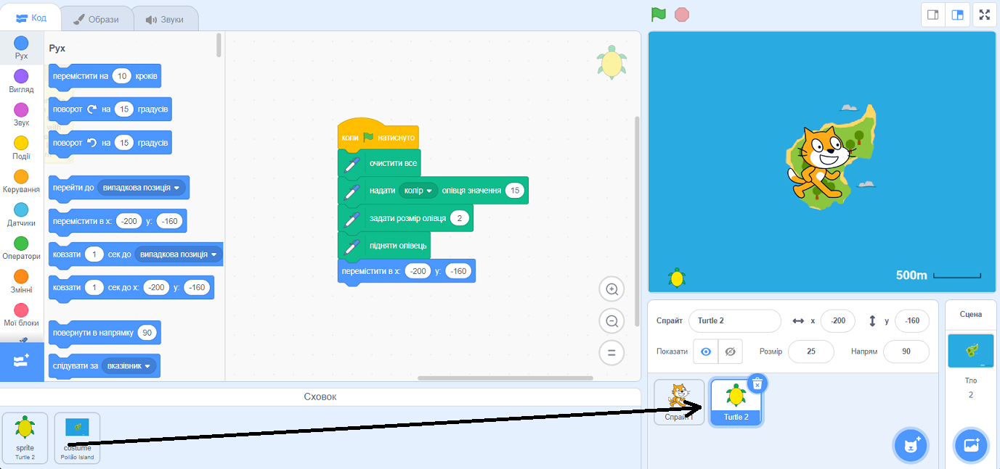

--- /print-only ---

- Щоб видалити елемент зі Сховку, знайди потрібний елемент на вкладці **Сховок**, потім натисни правою кнопкою миші (або на планшеті торкнись та утримуй) на елемент і вибери **вилучити**.

--- no-print ---

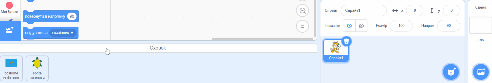

--- /no-print ---

--- print-only ---

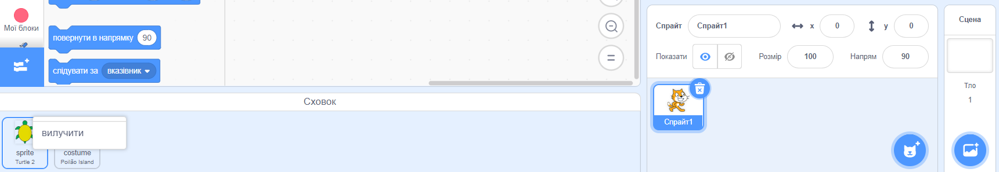

--- /print-only ---

- Ти можеш сховати Сховок, коли не використовуєш його. Щоб зробити це, натисни на вкладку **Сховок** внизу екрану.

--- no-print ---

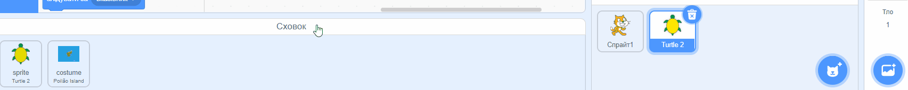

--- /no-print ---

--- print-only ---

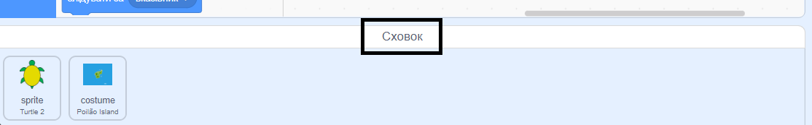

--- /print-only ---

***
Цей проєкт переклали волонтери:

[name]

[name]

[name]

Завдяки волонтерам, ми надаємо можливість людям у всьому світі навчатися рідною мовою. Ви також можете допомогти нам у цьому — більше інформації про волонтерську програму на [rpf.io/translate](https://rpf.io/translate).
